# Design Report — Extended-DBR Pockels Laser on Thin-Film Lithium Niobate

**Design:** [`design_candidate.yaml`](design_candidate.yaml)
**Run reported:** `20260811-081705-COMPLETE`, all seventeen stages in 13.4 min
**Verdict: PASS, 12 of 12 acceptance targets**

| | |
|---|---|
| acceptance targets | **12 of 12** |
| process corners | **9 of 9** |
| foundry rule deck, against the assembled die | **0 violations** |
| release readiness conditions | **10 of 10** |
| fitted correction factors anywhere in the chain | **none** |

**This is a working design.** It meets every target it was given, at every
declared process corner, on a die of a footprint the process offers, with a mask
that passes the foundry's own rule deck. §7.1 gives the target-by-target
verdict and §6.12 gives every stage and what each returned.

## What differs from the published device

The design departs from arXiv:2408.01743 where meeting the targets required it.
Nothing here is a defect and nothing is concealed: the differences are listed
first because they govern how every number in this report is to be read against
the paper.

| quantity | published | this design | why |
|---|---|---|---|
| post gap | 630 nm | **855 nm** | sets the coupling without moving the mode count; §6.11 |
| ridge width | 1.00 µm | **0.90 µm** | moves the multimode wall to a deeper etch |
| etch depth | 200 nm | **210 nm** | centres the acceptable band |
| grating length | 7.25 mm | **11.0 mm** | recovers the tuning lever against a 1000 µm gain chip |
| period | 1.27979 µm | **1.302 µm** | solved for the changed cross-section, then snapped to the 1 nm grid |
| electrode gap | 7.0 µm | **7.6 µm** | clears the metal-to-guide rule, centres the tuning |
| sidewall angle | not stated | **77°** | an ion-etched ridge has no vertical wall; sourced from an open PDK |
| gain chip | not identified | **LD-PD HP-GC-1550-1**, 1000 µm | a real part, with its datasheet figures |
| die | 5 × 10 mm | **20.2 × 5.05 mm** | the device is 11.35 mm long, and the process offers three sizes only |
| drive ceiling | 19 V DC, 17.5 Vpp | **30 V** | the chirp span demands 24.9 Vpp |

**The departure at the post gap is 36 %, and it is the largest.** The chain
asserts that this geometry works. It does not assert that it is the paper's, and
no claim of reproduction attaches to the grating.

Where a quantity is not listed above it follows the paper, and every geometric
figure in [`design_candidate.yaml`](design_candidate.yaml) is cited inline to
the source it came from.

## 0. How to Read This Report

**The answer is on the first page.** This design meets twelve of twelve targets,
nine of nine process corners, ten of ten release conditions, and its mask passes
the foundry rule deck with zero violations. What differs from the published
device is listed there too.

**Which design a number describes.** The working design, throughout, including
every figure. The single exception is **§7.2**, which gives the published
baseline's verdict for comparison and says so in its heading. The reproduction
attempt in full is a separate document,
[`TOOLCHAIN_VALIDATION.md`](TOOLCHAIN_VALIDATION.md).

**Where things are.**

| if you want | go to |
|---|---|
| what the device is, and the symbols used | §1, §2 |
| what was computed, by which tool, and when | §3.1, §3.2 |
| the geometry and the mask as drawn | §4, §5 |
| the physics, stage by stage | §6.1 to §6.5 |
| how the configuration was searched for | §6.6, and Annex A for what was tried and abandoned |
| what the process threatens | §6.7 sensitivity, §6.9 corners |
| whether it can be made | §6.10, §11, §12 |
| the correction of 2026-08-10 and what it cost | §6.11 |
| the verdict, and what it does not establish | §7, §10 |

**Three sections cover the mask** — §5 as drawn, §6.10 as checked, §11 as a
submission — and §12 lists what the die still lacks. They were written at
different times and are not consolidated. A reader after a single question about
the mask should expect to visit more than one.

## 1. What the Device Is

A laser requires three things: a medium that provides optical gain, a resonator
that returns light to that medium, and a mechanism that selects one wavelength.
In this device those three functions are divided between two chips.

**The gain chip.** A reflective semiconductor optical amplifier, abbreviated
RSOA. It is a separate semiconductor die, butt-coupled to the photonic circuit.
Its back facet is a mirror; its front facet is anti-reflection coated so that
light leaves it and enters the circuit. It supplies gain and nothing else.

**The passive circuit.** A waveguide formed in a 400 nm film of lithium niobate
bonded to oxide. Light entering from the gain chip is carried along it.

**The wavelength-selective mirror.** A distributed Bragg reflector, abbreviated
DBR. Rather than a single reflecting surface, several thousand small
perturbations are placed alongside the waveguide at a regular spacing. Each
scatters a little light backwards. Where the spacing matches half a wavelength in
the guide, those weak reflections add in phase and a strong reflection results;
at every other wavelength they cancel. The mirror is therefore a narrow-band
reflector, and the wavelength it selects is set by geometry.

The arrangement is termed **extended-DBR**, abbreviated E-DBR, because the
resonator extends from the back facet of the gain chip, across the coupling
interface, along the passive circuit, and into the grating. The resonator is
long, and a long resonator is what makes the emitted light spectrally pure.

**The tuning mechanism.** Lithium niobate is a Pockels material: its refractive
index changes in proportion to an applied electric field, and it does so within
picoseconds. Two gold electrodes flank the grating. A voltage applied across them
changes the index of the guide, which changes the spacing the grating "sees" in
optical terms, which moves the reflected wavelength. The laser follows. This is
the mechanism by which the output frequency is swept.

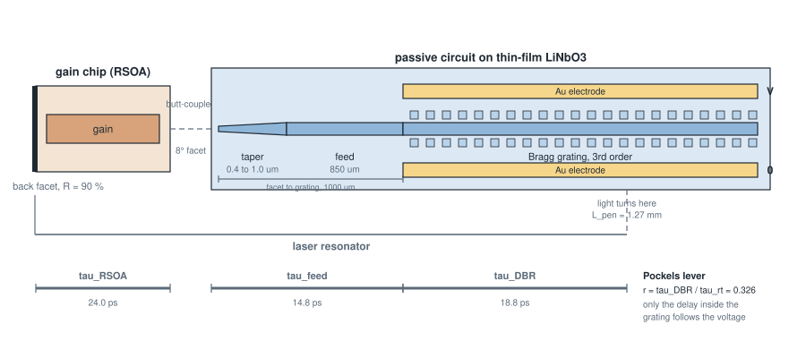

**Figure 1 — the architecture, and the delay budget that governs it.** The
resonator runs from the high-reflectivity back facet of the gain chip, across
the butt-coupled interface, along the taper and the feed, and into the grating
until the light turns. Only the delay lying *inside* the grating follows the
applied voltage, and the fraction it represents is the Pockels lever. It is 0.401
here, so the laser tunes at a third of the rate the mirror does. Every figure
annotated is from the run reported above.


**Why this device is of interest.** A frequency-swept source of narrow linewidth
is the central component of a coherent optical measurement system. The Pockels
effect provides a sweep that is fast and, unlike thermal or current tuning,
essentially free of hysteresis.

---

## 2. Nomenclature

### 2.1 Abbreviations

| abbreviation | expansion | meaning in this document |
|---|---|---|
| **E-DBR** | extended distributed Bragg reflector | the laser architecture: gain chip plus passive circuit terminated in a distributed mirror |
| **DBR** | distributed Bragg reflector | the mirror itself, formed by many weak periodic reflections |
| **RSOA** | reflective semiconductor optical amplifier | the gain chip |
| **TFLN** | thin-film lithium niobate | the material platform of this design |
| **TFLT** | thin-film lithium tantalate | the related platform to which the chain is applied afterwards |
| **CMT** | coupled-mode theory | the analytical method by which the grating is treated |
| **TMM** | transfer-matrix method | the numerical method by which the grating spectrum is evaluated |
| **EME** | eigenmode expansion | the method by which the taper is treated |
| **FDTD** | finite-difference time domain | the method by which taper radiation is computed |
| **FSR** | free spectral range | the frequency spacing between adjacent resonator modes |
| **FWHM** | full width at half maximum | the bandwidth of the mirror reflection |
| **SMSR** | side-mode suppression ratio | how far the strongest unwanted mode sits below the lasing one |
| **MHF** | mode-hop-free | the range over which the frequency sweeps continuously |
| **DRC** | design rule check | the geometric check that the mask can be manufactured |
| **GDS** | (GDSII) | the file format in which a mask is expressed |
| **BOX** | buried oxide | the oxide layer beneath the lithium niobate film |
| **PML** | perfectly matched layer | the absorbing boundary of a time-domain simulation |
| **DUV** | deep ultraviolet | the lithography used to print features of this size |
| **CD** | critical dimension | the smallest dimension the process must hold |

### 2.2 Symbols

Each symbol is given with its defining relation and with the path at which its
value is found in `metrics.json`, so that any figure quoted below can be traced
to the run that produced it.

| symbol | quantity | definition | metric path |
|---|---|---|---|
| λ | wavelength | the free-space wavelength, 1.5459 µm here | `mode.wavelength_um` |
| n_eff | effective index | the index the guided light experiences; it lies between that of the film and that of the oxide | `mode.n_eff_bare` |
| n_g | group index | n_eff − λ·(dn_eff/dλ). It sets how long light takes to traverse the guide, and hence the mode spacing | `mode.n_g` |
| Δn_eff | index perturbation | the change in n_eff caused by placing the Bragg posts alongside the guide | `mode.dn_eff_posts` |
| Γ_film | confinement | the fraction of the light inside the electro-optic film. Light outside it does not respond to voltage | `mode.confinement_film` |
| D | duty cycle | the fraction of one grating period occupied by the posts | `grating.duty_cycle` |
| Λ | grating period | the repeat distance of the posts | `grating.period_um` |
| m | grating order | the harmonic used. m = 3 permits a period three times larger, and therefore printable | `grating.order` |
| n̄ | mean index | n_eff + Δn_eff·D. It is this average, not n_eff, that sets the reflected wavelength | `grating.n_bar` |
| λ_B | Bragg wavelength | λ_B = 2·n̄·Λ/m. The wavelength the mirror reflects | `grating.bragg_wavelength_nm` |
| κ | coupling constant | reflection per unit length, in cm⁻¹. A strong grating has a large κ | `grating.kappa_per_cm` |
| L | grating length | 7.25 mm here | `grating.length_um` |
| κL | integrated coupling | the dimensionless product that fixes the peak reflectivity | `grating.kappa_L` |
| R | peak reflectivity | R = tanh²(κL) for a uniform grating | `grating.peak_reflectivity` |
| L_pen | penetration depth | how far into the grating the light travels before turning. It rises as κ falls | `grating.penetration_depth_mm` |
| Γ | electro-optic overlap | the fraction of the light that experiences the applied field. Always below one | `eo.eo_overlap_gamma` |
| r₃₃ | Pockels coefficient | the electro-optic coefficient of lithium niobate along its strong axis, 30.8 pm/V | `eo.r_pm_per_V` |
| Vπ·L | half-wave voltage-length | the voltage-length product for a π phase shift. Lower is better | `eo.VpiL_V_cm` |
| τ_DBR, τ_rt | group delays | the delay within the grating, and the delay around the whole resonator | `cavity.tau_dbr_ps`, `cavity.tau_roundtrip_ps` |
| **r** | **Pockels lever** | **r = τ_DBR/τ_rt. The fraction of the resonator that follows the mirror when voltage is applied. The most consequential quantity in this design** | `cavity.pockels_lever` |
| FSR | free spectral range | 1/τ_rt, the spacing between resonator modes | `cavity.fsr_GHz` |
| Δν | linewidth | the spectral purity of the emitted light, by the Schawlow-Townes-Henry relation | `cavity.schawlow_townes_henry_linewidth_kHz` |
| α | linewidth enhancement | a property of the gain chip; the linewidth scales as (1 + α²) | design input |
| n_sp | spontaneous emission factor | a property of the gain chip; both the linewidth and the SMSR scale with it | design input |

---

## 3. How the Chain Computes the Design

One YAML file describes the device. Seventeen stages are available and ten are
executed in dependency order, each writing a JSON block into one metric tree.
Seven run by default; the remainder are enabled per design, some on account of
their cost and some because the parameters they consume are not properties of
the photonic design.

| stage | question it answers | figure produced |
|---|---|---|
| `mode` | what shape does the light take in the guide, and what index does it experience? | `mode_profile.png`, `cross_section.png` |
| `taper` | does the taper carry the light without disturbing it? | — |
| `fdtd` | how much light does the taper radiate away, and what is κ by an independent route? | — |
| `bend` | at what radius does a routing bend stop being a straight guide? | — |
| `grating` | at what wavelength does the mirror reflect, how strongly, and over what bandwidth? | `grating_spectrum.png` |
| `eo` | how far does the wavelength move per volt, and at what electrical cost? | `eo_field.png` |
| `cavity` | what does the laser do: how far does it sweep, how pure is its light? | `cavity_tuning.png` |
| `dynamics` | what current does it need, what power results, how quiet is it, and is it stable against its own feedback? | `laser_dynamics.png` |
| `layout` | what does the mask look like? | `mask_plan.png` |
| `drc` | can the mask be manufactured? | — |
| `verify` | does the design meet its declared requirements? | — |

### 3.1 What was computed, by what, in order

The chain is sequential: each stage reads only the results of those before it,
and nothing reads a stage that follows. The table below is generated from the
run itself rather than written by hand, so it names the instrument that actually
executed. A stage that fell back to a different backend, or was skipped because
its solver could not be reached, is visible here and nowhere else.

| # | stage | question | instrument | result |
|---|---|---|---|---|
| 1 | `mode` | what shape does the light take, and what index does it see | semi-vectorial finite-difference mode solver, Stern formulation, anisotropic diagonal permittivity, on a graded mesh | n_eff 1.794; n_g 2.216; dn_eff from the posts 0.001119; guided modes 1 |
| 2 | `grating` | at what wavelength does the mirror reflect, how strongly, how wide | coupled-mode theory, the closed-form Fourier coefficient of the longitudinal profile at the working order, evaluated by transfer matrix | kappa 1.479; peak reflectivity 0.833; bandwidth 9.49; penetration depth 3.129 |
| 3 | `eo` | how far does the wavelength move per volt | finite-difference electrostatic solve of the electrode field, overlapped with the optical mode | overlap 0.3728; mirror tuning 708.1; Vpi.L 9.554 |
| 4 | `cavity` | what does the laser do | closed-form composite-cavity analysis, with the lasing mode followed numerically against applied voltage | Pockels lever 0.4006; mode-hop-free range 4.591; linewidth 4.263; SMSR 52.28 |
| 5 | `dynamics` | what current does it need, what power results, is it stable | single-mode carrier and photon rate equations, solved in closed form at the steady state | threshold current 78.72; output power 12.61; relaxation oscillation 1.445; feedback regime V |
| 6 | `layout` | what does the mask look like | polygon construction, emitted by <span style="color:#1a73e8"><strong>gdsfactory</strong></span> and by <span style="color:#1a73e8"><strong>KLayout</strong></span>, compared by exclusive-or | device length 8400; every period drawn yes |
| 7 | `drc` | can the mask be manufactured | rule engine on <span style="color:#1a73e8"><strong>KLayout</strong></span> regions (declared rules only, not a foundry deck) | rules checked 5; violations at severity error 0 |
| 8 | `mask` | is the mask connected as intended | connected-region and netlist extraction by <span style="color:#1a73e8"><strong>KLayout</strong></span>, with density by tile | extracted nets 11333 |
| 9 | `verify` | does the design meet its declared requirements | each target evaluated against the metric tree | verdict FAIL |

Every figure in the right-hand column is carried in `metrics.json` under the
stage named in the second, so any number quoted in this document can be traced
to the stage that produced it and to the method that stage used.

Three commands sit beside the stages. `picchain corners` re-runs the chain at the
edges of the process window and reports the spread of every target metric.
`picchain search` looks for a configuration meeting the targets, and is described
in §6.6. `picchain report` regenerates the figures and this report's tables from
a run directory without re-simulating.

Each stage reads only the results of those before it, and the requirements are
declared in the same file as the geometry, so the verdict is machine-checkable
and no plot need be read to know whether the design passes.

### 3.2 Run register

Every number in this document was produced by a named run. The register below
states what was executed, when, and against which parameters. Each run directory
carries `design.resolved.json`, which is the complete configuration after
defaults and overrides were applied, so the parameters recorded here are read
back from the run and are not a transcription of intent.

Two entries deserve attention before the table is read. The band-structure
measurement and the finite-element cross-check were both executed against the
published geometry, at 200 nm etch depth and a 630 nm post gap. The design has
since moved to 210 nm and 820 nm. Neither cross-check has been repeated on the
current cross-section, and neither is therefore a statement about the device as
now drawn.

| run | when | what was executed | parameters | outcome |
|---|---|---|---|---|
| `20260807-090923-CHECK` | 2026-08-07 09:09 | the full chain on the **baseline**, 12 stages, 45.4 s | film 0.400, etch 0.200, sidewall 77°, post gap 0.630, grating 7250 µm, period 1.27979 µm | verdict FAIL, 9 of 12; the run behind §3.1 and §7 |
| `20260807-153310-FINAL2` | 2026-08-07 15:33 | the full chain, 12 stages, 112.5 s | film 0.400, etch 0.210, sidewall 77°, post gap 0.820, grating 11000 µm, period solved to 1.30151 µm | verdict PASS; every declared target met |
| `20260807-153629` … `-154520`, `corners-000` … `-008` | 2026-08-07 15:36 – 15:45 | 9 one-factor process corners, 12 stages each, 40–118 s per corner | excursions ±0.02 on the post gap, ±0.01 on the film, ±0.01 on the etch, ±2.0° on the sidewall, about the run above | 9 of 9 corners PASS on `must` targets; MHF range spans 4.66 – 8.86 GHz |
| `20260807-154625-EME12` | 2026-08-07 15:46 | `mode` and `taper`, eigenmode expansion, 181.8 s | taper 150 µm, 0.4 → 0.9 µm, linear, 12 slices, 3 modes retained | adiabaticity margin 4.52 at 0.421 µm width; beat length 27.9 µm; conversion loss zero by construction |
| `20260807-155538-BEND2` | 2026-08-07 15:55 | `mode` and `bend`, conformal transformation, 78.1 s | radii 150, 100, 70, 50, 35, 25 µm | solved to 70 µm, caustic at 5.53 µm; refused at 50 µm and below, the caustic falling inside the window |
| `20260807-155236-RECESS` | 2026-08-07 15:52 | `mode`, `grating` and `layout`, 56.2 s | facet angle 8°, recess 5 µm, keep-out ±30 µm | facet plane and recess band both sheared at 8.0°; recess 5 µm deep across the full keep-out |
| `20260807-094611` … `-102648`, `MAP_*` | 2026-08-07 09:46 – 10:26 | a 5 × 5 film-and-etch grid, 25 chain runs | film 0.390 – 0.430 µm, etch 0.170 – 0.210 µm, both at 10 nm steps, post gap 0.700 | the acceptable region and the robust operating point of §6.9 |
| `20260806-233437-fix20` | 2026-08-06 23:34 | `mode`, `fdtd` and `grating`, photonic band structure, 10213 s | 20 px/µm, 26 px/period, mesh_size 7, tolerance 1e-9; **etch 0.200, post gap 0.630, grating 7250 µm** | κ 2.590 /cm against 3.689 /cm from the chain, ratio 0.702 |
| `20260804-133401-fem77` | 2026-08-04 13:34 | `mode` and `fem`, finite-element cross-check, 121.6 s | second-order elements, 3520 elements, 0.35 µm maximum edge; **etch 0.200, post gap 0.630** | n_eff 1.79349 against 1.79388, a relative difference of 2.2 × 10⁻⁴; Δn_eff from the posts agrees to 2.0 % |
| `20260808-092858-DECK2` | 2026-08-08 09:28 | `layout` and `drc` with the foundry runset, 48.3 s | foundry layer map applied; LN-CORE lnoi400 runset, I/O bound | 6 violations in 3 categories; 2 categories were genuine defects |
| `20260808-093228-DECK3` | 2026-08-08 09:32 | the same after both corrections, 45.4 s | as above | 3 violations, all in the enclosure category, which is not exercised at device level; in-process engine clean |
| `20260809-193521-BANDS40` | 2026-08-09 19:35 | the band structure at resolution 40, 3.2 h | post gap 820 nm, sigma 57.1 nm | converged; band gap 1.161x the coupled-mode value. **The comparison was not like for like and this ratio was read against an unsmoothed figure** |
| `20260810-222117-GAP855DIE` | 2026-08-10 22:21 | the die flow after the correction, 16 stages, 7.7 min | post gap 855 nm, sigma 0 | PASS 12/12, release 10/10, foundry deck 0 violations |
| `20260810-223801-BANDS855` | 2026-08-10 22:38 | the band structure at the corrected geometry, 2.7 h | post gap 855 nm, resolution 40 | converged; ratio 1.184, agreeing with the 820 nm measurement. **This is the figure to cite** |
| `20260811-064336-CLEAN855` | 2026-08-11 06:43 | the same after correcting the die-level expectations, 7.6 min | expected regions 19954, nets 19990 | PASS 12/12; zero blocking warnings |
| `20260811-081705-COMPLETE` | 2026-08-11 08:17 | **all seventeen stages in one record**, 13.4 min | as above | PASS 12/12, release 10/10, deck 0; the band structure reused in 10.1 s |
| `corners`, 2026-08-11 | 2026-08-11 00:03 | the process window at the corrected geometry, 9 corners over 4 parameters, 4 stages each | post gap +-20 nm, film +-10 nm, etch +-10 nm, sidewall +-2 deg | **9 of 9 pass.** Peak reflectivity reaches 0.887 against 0.90 and the linewidth 5.383 kHz against 5.6 |

Timestamps are local and are the run identifier itself. A run directory is never
overwritten, so any row above can be reopened and its `metrics.json` read
directly.

The candidate's own provenance table follows, in the same form as §3.1 and read
from `20260807-153310-FINAL2`. It is placed here rather than in §3.1 so that the
two designs are never read as one.

| # | stage | instrument | result |
|---|---|---|---|
| 1 | `mode` | semi-vectorial finite-difference mode solver, Stern formulation, anisotropic diagonal permittivity | n_eff 1.782; n_g 2.214; dn_eff from the posts 5.0519e-04; guided modes 1 |
| 2 | `grating` | coupled-mode theory, the closed-form Fourier coefficient at the working order, evaluated by transfer matrix | kappa 1.276; peak reflectivity 0.7605; bandwidth 8.646 GHz; penetration depth 3.472 mm |
| 3 | `eo` | finite-difference electrostatic solve, overlapped with the optical mode | overlap 0.3536; mirror tuning 613.1 MHz/V; Vpi.L 11.04 V·cm |
| 4 | `cavity` | closed-form composite-cavity analysis, the lasing mode followed numerically against applied voltage | Pockels lever 0.6554; mode-hop-free range 8.203 GHz; linewidth 2.204 kHz; SMSR 53.2 dB |
| 5 | `dynamics` | single-mode carrier and photon rate equations at the steady state | threshold current 26.49 mA; output power 24.93 mW; relaxation oscillation 2.698 GHz; feedback regime V |
| 6 | `layout` | polygon construction, emitted by <span style="color:#1a73e8"><strong>gdsfactory</strong></span> and by <span style="color:#1a73e8"><strong>KLayout</strong></span>, compared by exclusive-or | device length 11350 µm; every period drawn |
| 7 | `drc` | rule engine on <span style="color:#1a73e8"><strong>KLayout</strong></span> regions | 5 rules checked; 0 violations at severity error |
| 8 | `mask` | connected-region and netlist extraction by <span style="color:#1a73e8"><strong>KLayout</strong></span> | 16907 nets extracted |
| 9 | `verify` | each target evaluated against the metric tree | verdict PASS, 12 of 12 |

The candidate differs from the baseline in four declared quantities. The etch is
deepened from 200 to 210 nm. The post gap is opened from 630 to 820 nm, which is
what weakens the mirror. The grating is lengthened from 7250 to 11000 µm. The
period is solved for the changed cross-section rather than carried over, landing
at 1.30151 µm against the published 1.27979 µm. The gain chip is a sourced part
rather than an assumed one, and is described in §6.5.

---

## 4. The Design as Drawn

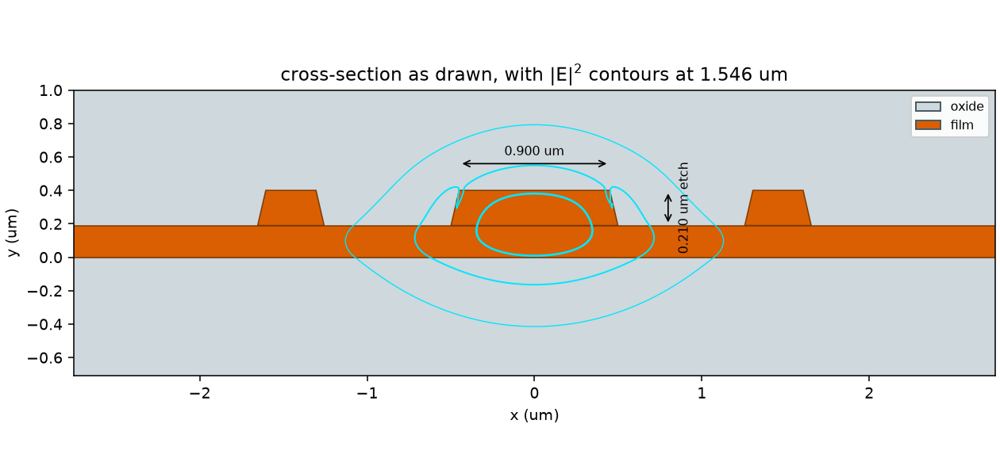

**Figure 2 — the waveguide cross-section, as simulated.** Orange is lithium
niobate, grey is silicon dioxide. The cyan contours are the guided mode at one
half, one tenth and one hundredth of its peak intensity. The walls are drawn at
77°, so each 200 nm feature overhangs its own top edge by 46 nm; the
consequence for the post gap is set out below. Drawn from the geometry the
solver was given, not from the design file.

Three features of Figure 2 carry the design.

**The ridge is shallow.** The film is 400 nm thick and only 200 nm of it is
etched away either side of the guide. The light is therefore held loosely: it
spreads well beyond the ridge, as the contours show. This is deliberate. A
weakly held mode is one that a modest perturbation can influence, which is what
both the grating and the electrodes require.

**The Bragg posts stand apart from the guide.** The two blocks either side of
the ridge are one period of the grating, seen end on. They do not touch the
waveguide; their top edges sit 630 nm from its top edge, within the outer part
of the light. It is this weak overlap that makes the reflection per period
small, which is what a distributed mirror requires.

**The separation quoted is not the separation that matters.** The walls are
sloped at 77°, so a 200 nm-tall feature overhangs its own top edge by 46 nm on
each side. The ridge and the post each advance into the space between them, and
the gap therefore closes from 630 nm at the top to **538 nm at the base**. This
is why sloping the wall raises the coupling constant by a third rather than
lowering it: the perturbation is measured where the two features are nearest,
and that is the base. A gap specified "from the waveguide edge" is ambiguous by
almost a hundred nanometres on this geometry, which is half of the discrepancy
against the published device discussed in
[TOOLCHAIN_VALIDATION.md](TOOLCHAIN_VALIDATION.md).

**Nothing else is nearby.** The electrodes are 3.5 µm away on either side, far
outside the frame of Figure 2. Gold absorbs light, so they are placed where
essentially none of it reaches.

| geometric input | value | why it is set so |
|---|---|---|
| film thickness | 400 nm | as published |
| etch depth | 200 nm | shallow, so that the mode is loosely held |
| ridge top width | 1.0 µm | the widest that remains single-moded |
| sidewall angle | 77° | the paper does not state it; taken from an open foundry kit for the same stack |
| Bragg post width | 300 nm | as published |
| Bragg post gap | 630 nm | as published, from the ridge top edge |
| grating period | 1.27979 µm | third order, so that DUV lithography can print it |
| grating length | 7.25 mm | as published |
| electrode gap | 7.0 µm | as published |
| buried oxide | 4.7 µm | thick enough that the silicon handle beneath is not seen |

---

## 5. The Mask

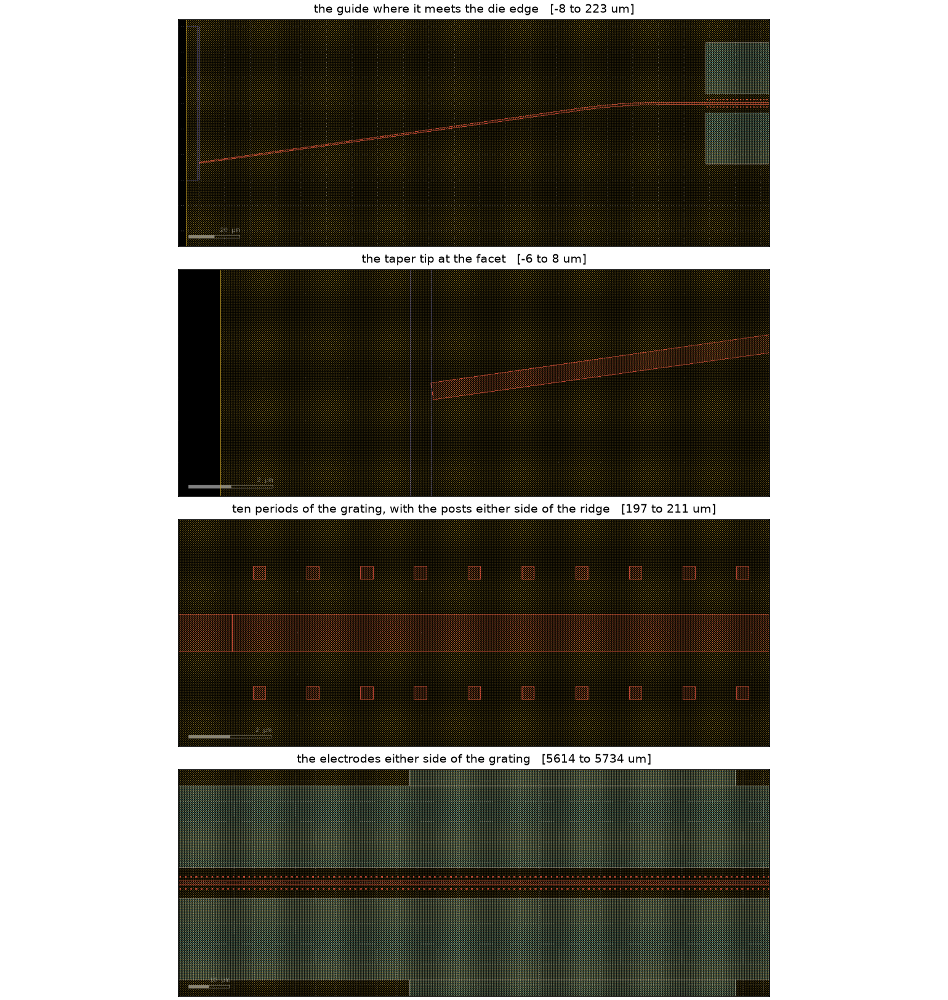

**Figure 3 — the mask, as the layout viewer draws it.** Rendered by
<span style="color:#1a73e8"><strong>KLayout</strong></span> from the emitted GDS,
with the layer properties the run itself wrote, so the colours are the process's
own and the geometry is whatever the file contains. Earlier revisions redrew the
polygons here with a window and a palette chosen by the report, and that
redrawing misled: a vertical window fixed at ±1.2 µm about the die axis showed
the tail of the routed lead-in and captioned it the input taper.

Four views, each the whole of a critical feature.

**The guide where it meets the die edge.** It leaves a perpendicular edge 23.3 µm
off the die axis and returns to it through a 250 µm arc, having carried the taper
on the angled straight. The blue band is the facet recess.

**The taper tip at the facet**, 0.400 µm across the guide's own axis. The end
face is cut perpendicular to that axis, so it stands 8° from the die edge.

**Ten periods of the grating.** The 0.90 µm ridge with 0.30 µm posts standing
0.855 µm from its edge on either side. That gap is what sets the coupling, and κ
falls exponentially with it at about 5.4 µm⁻¹.

**The electrodes either side of the grating**, on a 7.6 µm gap. The optical power
beyond the inner edge is 1.6 × 10⁻⁹ of the mode, four orders below the bound.

## 6. What the Chain Computes

### 6.1 The guided mode


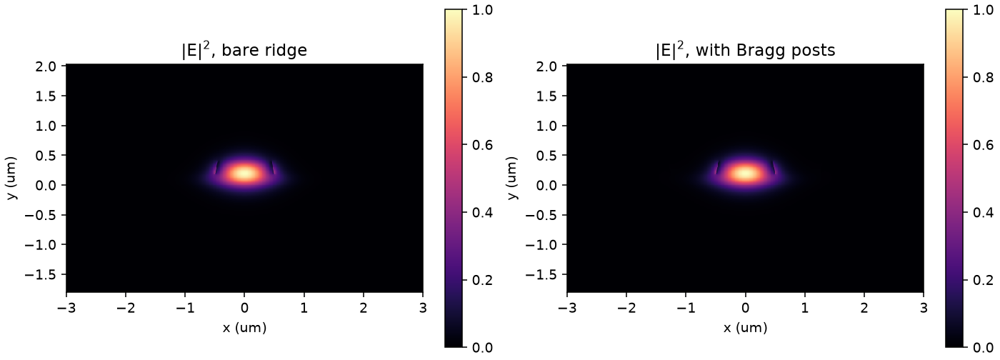

**Figure 4 — the guided mode, without and with the Bragg posts.** The two panels
look identical, which is the point: the posts perturb the effective index by
about one part in sixteen hundred. That perturbation is sufficient because it is
repeated 5665 times.

| quantity | value | reading |
|---|---|---|
| n_eff | 1.7815 | between the film index (2.14) and the oxide (1.44), as a guided mode must be |
| n_g | 2.2158 | 24 % above n_eff. Using n_eff in place of n_g when computing tuning would over-predict it by that amount |
| Δn_eff from the posts | 1.12 × 10⁻³ | the perturbation on which the whole mirror depends |
| confinement in the film | 0.717 | 72 % of the light is in the electro-optic material |
| guided modes | 1 | single-moded, as required |

The two panels of Figure 4 look identical, and that is the point: the posts
perturb the index by about one part in sixteen hundred. That perturbation is
nonetheless sufficient, because it is repeated 5665 times.

### 6.2 The mirror

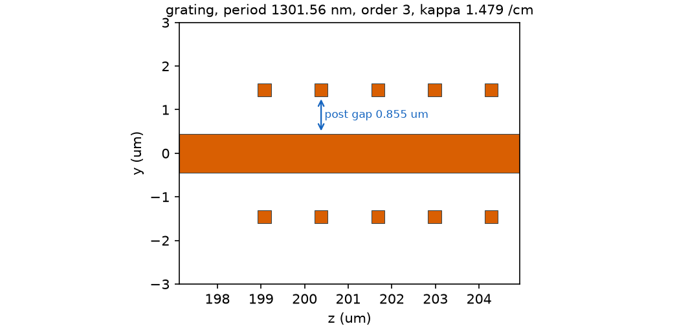

**Figure 12 — the grating, as drawn.** Five periods read back from the mask, at
true scale. The 0.90 µm ridge runs through the centre and the 0.30 µm square
posts stand 0.855 µm from its edge on either side. That gap is the parameter this
design turns on. κ falls exponentially with it at about 5.4 µm⁻¹, so 20 nm of
lithographic error is 11 % of κ, while the ridge alone sets how many modes the
guide holds. Decoupling those two is what opened a process window at all, and the
figure exists so that the gap the model used and the gap the mask carries can be
compared without trusting either to a number.

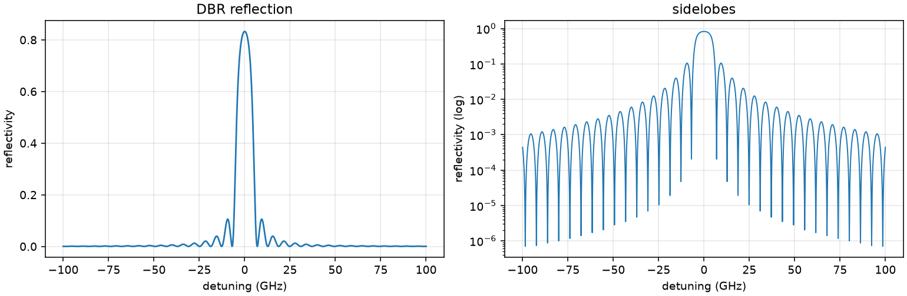

**Figure 5 — the mirror, computed by transfer matrix.** Left: reflectivity
against detuning from the Bragg wavelength. Right: the same on a logarithmic
scale, where the sidelobes are visible. The grating is uniform, so the first
sidelobes sit about 5 dB below the peak and appear later as sweep
non-linearity.

| quantity | value | reading |
|---|---|---|
| Bragg wavelength λ_B | 1545.9 nm | the period is solved to land on it, then snapped to the grid |
| coupling constant κ | 2.75 cm⁻¹ | after the measured profile-smoothing correction of §6.2.1 |
| κL | 2.836 | |
| peak reflectivity R | 97.5 % | against approximately 75 % reported. **This is the one failure of severity `must`** |
| bandwidth FWHM | 9.49 GHz | 1.74 times the transform limit of 5.45 GHz for an 11 mm grating |
| sidelobe suppression | 5.4 dB | low, and a direct consequence of the grating being unapodised |
| penetration depth L_pen | 1.75 mm | the light turns within the first quarter of the grating |

The right-hand panel of Figure 5 explains a warning the run emits. The grating
is uniform,
every period being identical, and a uniform grating always exhibits sidelobes
about 9 dB below its peak. Those sidelobes are additional reflection maxima. They
compete with the intended one and appear later as sweep non-linearity. The remedy
is apodisation, which is a gradual variation of the coupling strength along the
grating, and it is available in the chain but not used here because the paper
does not use it.

### 6.3 The tuning electrodes

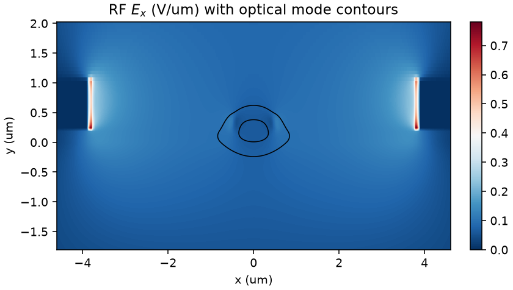

**Figure 6 — the electrostatic field, and the mode it must overlap.** The
electrodes stand 3.5 µm either side of a 1 µm guide. The overlap integral
between this field and the optical intensity within the electro-optic film is
Γ, and it is the factor by which a material coefficient becomes a volts figure.

| quantity | value | reading |
|---|---|---|
| electro-optic overlap Γ | 0.373 | only 37 % of the light experiences the applied field. The remainder is wasted |
| mirror tuning | 708 MHz/V | how far the *mirror* moves per volt |
| Vπ·L at Γ = 1 | 3.56 V·cm | the idealised figure, comparable with the 4 V·cm quoted in the paper |
| Vπ·L including Γ | 9.55 V·cm | **the physical figure**, 2.7 times worse |
| capacitance | 0.87 pF | |
| light reaching the metal | 1.3 × 10⁻⁸ | negligible, so the electrodes add no absorption |

The distinction between the two Vπ·L figures is the most easily misread quantity
in this design. A quoted Vπ·L that omits the overlap factor describes a device
that does not exist. The physical figure is the one against which a driver
amplifier must be sized.

### 6.4 The laser

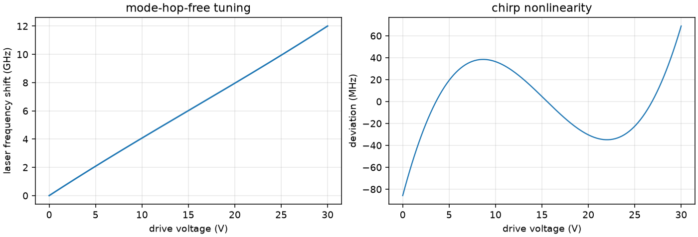

**Figure 7 — the laser, swept.** Left: the emitted frequency against drive
voltage, which is a straight line across the whole 30 V range: **the working
design encounters no mode hop at all within its drive limit**, and the 12.01 GHz
it reaches is set by the supply rather than by the cavity. Right: the deviation
from that straight line, which is the quantity a frequency-modulated measurement
is sensitive to, and it stays within ±70 MHz.

The published geometry does hop, at 14.0 V and after only 4.59 GHz. That
comparison is in §7.2 and the reasoning is in
[`TOOLCHAIN_VALIDATION.md`](TOOLCHAIN_VALIDATION.md). Right: the deviation from a straight line, which is the quantity
a frequency-modulated measurement is sensitive to.

This is where the device numbers become laser numbers.

| quantity | value | reading |
|---|---|---|
| resonator round-trip delay τ_rt | 73.22 ps | 46.25 in the grating, 24.02 in the gain chip, 2.95 in the feed |
| delay within the grating τ_DBR | 46.25 ps | the penetration depth is 3.13 mm into an 11 mm grating |
| **Pockels lever r** | **0.632** | **63 % of the resonator follows the mirror** |
| free spectral range | 13.66 GHz | the spacing between adjacent resonator modes, 1/τ_rt |
| mirror tuning | 613.0 MHz/V | what the grating alone does |
| laser tuning | 395.1 MHz/V | r × 613.0, and not 613.0 |
| **mode-hop-free range** | **12.01 GHz** | **no mode hop occurs**; the range is set by the 30 V supply, against 8 GHz required |
| sweep non-linearity | 0.257 % | |
| linewidth Δν | 4.95 kHz | against 2.8 kHz measured |
| SMSR | 50.5 dB | |

Read from run `20260811-081705-COMPLETE`.

**The lever is the quantity that changed most against the published geometry.**
It is 0.632 here against 0.401 for the paper's 7.25 mm grating, and the whole of
that gain came from lengthening the grating to 11 mm, which deepens the
penetration from 1.75 mm to 3.13 mm and so puts more of the round trip inside the
element that actually tunes. The tuning range follows: 12.01 GHz against 4.59.

**The range is bounded by the supply and not by the cavity**, and the report
says so wherever it quotes the figure. `range_limited_by` reads `drive limit`,
and no mode hop occurs anywhere in the sweep. The cavity's own bound is higher
still.

**The Pockels lever is the quantity to understand.** When voltage is applied, the
mirror moves. The rest of the resonator, being the gain chip and the feed
waveguide, does not: no field is applied to it. The laser frequency is set by the
resonator as a whole, so it follows the mirror only in proportion to the fraction
of the round-trip delay that the mirror represents. Here that fraction is 0.401,
so the laser tunes at 40 % of the mirror rate.

The same fraction limits how far the sweep can run. As the mirror moves and the
resonator modes do not, the two slip against one another. When the slip reaches
half a mode spacing, a neighbouring mode becomes the favoured one and the laser
hops. The excursion available before that occurs is 4.59 GHz. The sweep is clamped to the 20 V the paper reports the electronics delivering; the hop arrives at 14.0 V, so the clamp does not truncate the range.

> **How this configuration was arrived at is in Annex A.** Two lines of
> attack were tried and abandoned before the one that works, and each
> records why an obvious remedy fails: lengthening the grating alone
> asymptotes short of the requirement, and weakening the mirror alone does
> likewise. That reasoning is worth keeping and is not needed here.

### 6.5 The carrier dynamics

Sections 6.1 to 6.4 treat the optical power as given. They therefore cannot say
what current the device requires, what power results, how quickly it may be
modulated, how quiet it is, or whether it is stable at all. Each of those
requires the carrier density to be a dynamical variable, which the `dynamics`
stage supplies by solving the single-mode rate equations.

#### The gain chip is a sourced part

None of the carrier parameters is obtainable from the photonic design. Each is a
property of the semiconductor and of the active waveguide, and a gain chip is
bought against a datasheet rather than designed here. The part carried by the
candidate is the **LD-PD HP-GC-1550-1**, a 1550 nm reflective semiconductor
optical amplifier.

| quantity | value | status |
|---|---|---|
| chip length | 1000 ± 20 µm | sourced |
| rear facet reflectivity | 90 % | sourced |
| front facet reflectivity | 0.01 % | sourced |
| active region | 3 strained quantum wells of 8 nm, 0.024 µm total | sourced |
| optical confinement factor | 0.035 | calibrated |
| differential gain, transparency density, carrier lifetime, gain compression, spontaneous coupling, injection efficiency, active width, internal loss, α, n_sp | — | assumed, ordinary for a 1550 nm InP multiple-quantum-well ridge |

Three corrections followed from sourcing the part rather than assuming it.

The active thickness had been taken as 0.10 µm. The real stack is three wells of
8 nm, which is 0.024 µm. The assumed value overstated the volume that must be
inverted by a factor of four, and the threshold current it produced was 82 mA
against the 20 to 40 mA the datasheet quotes.

The chip length had been taken as 300 µm. Parts of this class are 600 to
1000 µm. The length enters the external round trip, which sets the ceiling on
the mode-hop-free range, so the assumption was not conservative.

The confinement factor is calibrated rather than sourced. It is the one
parameter adjusted so that the computed threshold falls inside the datasheet
band, and it is recorded as calibrated for that reason. With it, the threshold is
26.5 mA and the output power is 24.9 mW at 150 mA.

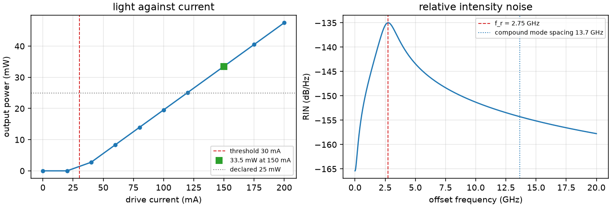

**Figure 9. The rate-equation results.** Left, output power against drive
current, with the threshold, the operating point and the power the design file
declares. Right, the relative intensity noise, with the relaxation oscillation
and the compound-mode spacing marked.

| quantity | value |
|---|---|
| photon lifetime, composite cavity | 22.35 ps |
| round-trip survival | 5.52 % |
| cold-cavity Q | 27,500 |
| output coupling fraction | 0.273 |
| threshold current | 78.7 mA |
| slope efficiency | 0.177 W/A |
| output power at 150 mA | 12.61 mW |
| relaxation oscillation | 1.45 GHz |
| damping ratio | 0.379 |
| small-signal bandwidth | 2.19 GHz |
| RIN peak | −120.7 dB/Hz |
| RIN at 1 GHz offset | −127.6 dB/Hz |

The photon lifetime is that of the composite cavity. It is taken from the
fraction of the power surviving one round trip with the gain switched off, so
the passive feed, the two coupling interfaces and the DBR are already inside it.

Three observations follow.

**The output power is now derived rather than asserted.** The rate equations
give 12.61 mW at 150 mA against the figure above 15 mW the paper quotes. The
agreement to 20 % is obtained with gain-chip parameters that are assumptions,
so it is a consistency check rather than a prediction. It matters because
`cavity.rsoa.output_power_mW` is what the Schawlow-Townes-Henry linewidth is
computed from, and that quantity had no independent route to it before.

**The relaxation oscillation stands clear of the compound-mode spacing.** At
1.45 GHz against 15.45 GHz, the relaxation-oscillation sidebands do not fall on
a neighbouring cavity mode. Were they to do so, mode partition would follow, and
the single-mode equations solved here would no longer describe the device. The
stage raises a warning in that case rather than answering.

**The anti-reflection coating is what holds the laser stable.** This is the
observation the architecture turns on, and nothing in the chain expressed it
before. An extended-cavity laser is operated under strong optical feedback
deliberately. The Lang-Kobayashi parameter is 361, far above unity, and the
device is nonetheless stable because the external mirror exceeds the chip facet
by 36.6 dB and therefore owns the cavity outright. Degrading the coating moves
the device toward coherence collapse without changing any other quantity the
chain reports.

| front facet R | margin | C | regime |
|---|---|---|---|
| 1 × 10⁻⁴, as designed | 36.6 dB | 361 | V, stable |
| 1 × 10⁻³ | 26.8 dB | 97 | V, stable |
| 5 × 10⁻³ | 19.9 dB | 43 | IV, coherence collapse |
| 1 × 10⁻² | 16.8 dB | 30 | IV |

The coating may degrade by a factor of thirty before the laser destabilises.
That is a reliability margin rather than a design one, and it is the figure to
carry into a qualification plan.

The equations are single mode and are solved at a steady state. No differential
equation is integrated, so mode competition and the transient during a chirp
ramp are outside them. The regime classification is a criterion applied to the
computed parameter and to the reflector ratio; it is not a stability analysis of
the Lang-Kobayashi equations.

### 6.7 Sensitivity, and what the process actually threatens

`picchain sensitivity` perturbs each parameter either side of nominal and reports
two matrices. They answer different questions.

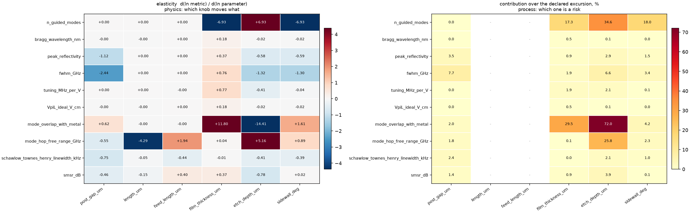

**Figure 10 — the sensitivity matrices.** Left, elasticity, on a diverging scale
symmetric about zero so that sign reads as colour and magnitude as saturation.
Right, the contribution over the declared corner excursion. A parameter with no
declared excursion leaves its column blank on the right, the process not
constraining it here. Reading the two together is the point: the overlap with the
metal is the darkest cell in **both** panels and is no risk whatever.

**Elasticity**, d(ln metric)/d(ln parameter), is a property of the physics and
ranks the knobs.

| metric | post gap | film | etch depth | sidewall |
|---|---:|---:|---:|---:|
| guided-mode count | +0.00 | −6.93 | +6.93 | −6.93 |
| peak reflectivity | −1.12 | +0.37 | −0.58 | −0.59 |
| bandwidth | −2.44 | +0.76 | −1.32 | −1.30 |
| electro-optic tuning | +0.00 | +0.77 | −0.41 | −0.04 |
| mode overlap with metal | +0.62 | +11.80 | −14.41 | +1.61 |
| linewidth | −0.75 | −0.01 | −0.41 | −0.39 |

The mirror rows are trustworthy: they agree to within a few per cent with the
same quantities computed from the wider corner excursions, which is an
independent route to them.

**Contribution**, the half-span over the excursion declared in
`corners.parameters`, is a property of the process and ranks the risks.

| metric | post gap ±20 nm | film ±10 nm | etch ±10 nm | sidewall ±2° |
|---|---:|---:|---:|---:|
| guided-mode count | 0.0 % | 17.3 % | **34.6 %** | 18.0 % |
| peak reflectivity | 3.5 % | 0.9 % | 2.9 % | 1.5 % |
| bandwidth | 7.7 % | 1.9 % | 6.6 % | 3.4 % |
| mode overlap with metal | 2.0 % | 29.5 % | 72.0 % | 4.2 % |

Neither table is risk on its own. The overlap with the metal carries the largest
elasticity in the matrix and the largest contribution, and is no risk whatever,
sitting three orders of magnitude below its bound. Risk is the contribution set
against the margin the target leaves, and that comparison requires the target as
well as both tables.

#### The single-mode condition is what the process threatens

Reading the per-corner failures rather than the aggregate spread:

| excursion | `must` targets that fail |
|---|---|
| film thickness −10 nm | **guided-mode count**, peak reflectivity |
| film thickness +10 nm | peak reflectivity, electro-optic tuning |
| etch depth −10 nm | peak reflectivity, electro-optic tuning |
| etch depth +10 nm | **guided-mode count** |
| sidewall −2° | **guided-mode count**, peak reflectivity |
| sidewall +2° | none |
| post gap ±20 nm | peak reflectivity at one end, none at the other |

**The guide carries a second mode at three of the eight excursions.** Single-mode
operation is a `must` target and an assumption every stage downstream relies on,
and it is lost at ordinary process variation in the film thickness, the etch
depth and the sidewall angle, each of which enters it at an elasticity near
seven. This was not visible in the corner summary of §6.8, which aggregates
spreads and reports verdicts without saying which target failed where.

The remedy is a cross-section with margin against the second mode rather than one
sitting at the single-mode boundary, and that is a change to the ridge width and
etch depth rather than to the grating.

#### A coupling that no single-parameter study reveals

The configuration the search of §6.6 returned meets every physical target and
cannot be manufactured. At a 740 nm post gap the outer edge of a Bragg post
stands 1.54 µm from the guide centre, the electrode inner edge stands at 3.50 µm,
and the separation of 1.96 µm fails a 2.00 µm rule at every post: 11,330
violations, two per period.

Widening the electrode gap to 7.2 µm clears the rule. It also lowers the
electro-optic overlap, which lowers the tuning rate, which lowers the tuning
range. The chain of causation runs

    post gap up -> posts approach the electrodes -> electrode gap must widen
                -> overlap down -> tuning down -> tuning range down

and it ends 2.3 % below the requirement. Every `must` target passes at that
point; the tuning range, a `should`, does not.

None of the three studies above finds this. Sensitivity perturbs one parameter at
a time and reports no interaction. The corner study excurses one factor at a time
for the same reason. The search moved the post gap without the electrode gap
being free to follow, and without the rule check in its stage subset, so it
returned a mask that the rule deck rejects.

Both omissions are now corrected in the design file: `electrodes.gap_um` is a
declared search parameter and `layout, drc` are in the search's stage subset. The
constraint cannot be written into `search.constraints`, which compares two fields,
because it is an arithmetic combination of four dimensions. Running the rule check
is the honest way to enforce it, at the cost of seconds per evaluation.

The general statement is that a one-factor-at-a-time study cannot see an
interaction, and that a geometric rule is exactly where interactions live.

#### A caution on the tuning range

The mode-hop-free range admits no elasticity. Against the sidewall angle it
returns +17.2 over a ±2° excursion and +0.9 over a ±5 % probe, differing by a
factor of nineteen, because the metric doubles back within the range. The
reachability phase of §6.6 flags the same condition independently. Any derivative
quoted for that metric is a statement about the width of the perturbation and not
about the design.

### 6.8 The taper

Two stages examine the taper, and they answer different questions.

The eigenmode expansion reports that the taper is **single-moded along its whole
length**, so no power can be converted into another guided mode: the conversion
loss is zero by construction, and the only loss available is radiation. Its
adiabaticity margin falls to **2.74** at a width of 0.425 µm, which locates the
narrow end as the section to examine.

The time-domain solve then quantifies it. At three resolutions the loss is
0.0073, 0.0039 and 0.0025 dB, falling as the mesh is refined, which is the
signature of a numerical floor rather than of a physical loss. **The lateral
radiation of this taper is therefore below approximately 0.015 dB**, that bound
being set by the consistency of the solve.

The margin of 2.74 was initially read as indicating a taper that radiates. It
does not, and the time-domain solve is the arbiter. Details are in
[TOOLCHAIN_VALIDATION.md](TOOLCHAIN_VALIDATION.md).

The taper was re-solved on the candidate cross-section, where the ridge is
0.90 µm rather than 0.85 µm, in run `20260807-154625-EME12`. The margin rises to
**4.52**, at a width of 0.421 µm and a beat length of 27.9 µm. The wider ridge is
therefore the more adiabatic of the two, and the narrow end remains the section
that governs.

One figure from that run must not be read as a loss. The staircase deficit is
3.2 % across 12 slices, and it falls to 3.0 % when the slice count is halved.
A quantity that does not fall as the discretisation is refined is a residue of
the projection onto a truncated mode set. It is reported so that the coarseness
of the staircase is visible, and it is not a radiation estimate. The conversion
loss agrees between the two slice counts to 1 × 10⁻¹⁵ dB, which is the sense in
which the solve has converged.

### 6.9 How much of the process window meets the design

A single run describes the design as drawn. What is fabricated is a
distribution. `picchain corners` re-runs the chain at the edges of the window,
here ±20 nm on the post gap and ±10 nm on both the film thickness and the etch
depth.

| metric | nominal | across the window | spread |
|---|---:|---|---:|
| κ | 2.75 cm⁻¹ | 2.46 to 3.07 | 22 % |
| peak reflectivity | 0.833 | 0.763 to 0.887 | 14.9 % |
| Bragg wavelength | 1531 nm | 1524 to 1538 | 0.9 % |
| mirror bandwidth | 9.49 GHz | 8.66 to 10.45 | 18.9 % |
| mirror tuning | 708 MHz/V | 694 to 723 | 4.1 % |
| **mode-hop-free range** | **4.59 GHz** | **2.27 to 6.20** | **85 %** |
| SMSR | 52.3 dB | 48.4 to 52.8 | 8.4 % |

Two of nine corners pass.

**The continuous tuning range still varies by a factor of nearly three across an
ordinary process window**, while the wavelength moves by under one per cent. For
a swept source that is the ranking of concerns reversed from what a nominal run
suggests: the wavelength will land where intended and the sweep range will not.
A design centred at 4.59 GHz might be delivered anywhere between 2.3 and 6.2 GHz.

The spread has narrowed from 189 % to 85 % since the profile-smoothing
correction of §6.2.1. A weaker mirror sits further from the saturation of
R = tanh²(κL), so the same fractional excursion in κ produces a smaller
excursion in the penetration depth that sets the Pockels lever. The correction
therefore improved the manufacturability of the design as well as its nominal
figures, which was not anticipated.

Two design responses follow, and they are the same two the coupling constant
already implied: centre the design where the sensitivity of performance to κ is
small, or provide a means of trimming κ after fabrication.

#### The candidate over the same window

The first of those two responses was taken. The candidate re-runs the same nine
one-factor corners, at the same excursions, and the result is in
[`runs/corners.md`](runs/corners.md).

| metric | nominal | across the window | spread |
|---|---:|---|---:|
| κ | 1.276 cm⁻¹ | 1.116 to 1.457 | 27 % |
| peak reflectivity | 0.761 | 0.684 to 0.826 | 19 % |
| Bragg wavelength | 1545.9 nm | 1545.9 to 1545.9 | 0 |
| mirror bandwidth | 8.65 GHz | 8.00 to 9.41 | 16 % |
| mirror tuning | 613 MHz/V | 598 to 628 | 5.0 % |
| **mode-hop-free range** | **8.20 GHz** | **4.66 to 8.86** | **51 %** |
| SMSR | 53.2 dB | 50.8 to 54.0 | 5.9 % |

**Nine of nine corners pass on the targets of severity `must`.** Eight of nine
pass on all targets. The one miss is the etch deepened by 10 nm, where the
mode-hop-free range reads 4.66 GHz against the 8 GHz requirement.

That miss is a discontinuity and not a gradient. The range is measured as the
largest span between mode hops, so a corner at which an additional hop appears
inside the sweep loses roughly half the span at once. The remaining seven
corners lie between 7.9 and 8.9 GHz, which is the behaviour of a smooth metric,
so the outlier is the corner at which a hop crosses into the swept interval.

Two features of the table are worth separating from the rest. The Bragg
wavelength no longer moves at all across the window, because the period is now
solved for the cross-section at each corner rather than carried over from the
publication. The spread of the tuning range has fallen from 85 % to 51 %, for
the same reason the smoothing correction narrowed it: the mirror is weaker and
sits further from the saturation of R = tanh²(κL).

### 6.10 Manufacturability

All five geometric rules pass on the emitted mask.

| rule | dimension | violations |
|---|---|---|
| waveguide minimum width | 200 nm | 0 |
| waveguide minimum space | 300 nm | 0 |
| metal minimum width | 2.0 µm | 0 |
| metal to waveguide separation | 2.0 µm | 0 |
| waveguide minimum area | 0.04 µm² | 0 |

These are the rules declared in the design file, evaluated in process. They are a
smoke test and attest to the rules supplied and to nothing else.

A foundry runset is executed separately, through the <span style="color:#1a73e8"><strong>KLayout</strong></span> application, by
setting `drc.deck`. The mechanism is demonstrated by
[`smoke_deck.drc`](smoke_deck.drc), which is not a foundry deck: run against the
mask with the post gap opened to 762 nm it reports 800 violations of
`METAL_to_WG_sep`, exactly matching the independent in-process engine, which is
what makes the zero on the nominal mask meaningful.

#### The foundry runset, executed

The LN-CORE lnoi400 runset was obtained on 2026-08-08 and is held at
[`design-chain/pdk/LXT_KLayout_DRC_Runsets/`](../../design-chain/pdk/LXT_KLayout_DRC_Runsets/).
It is executed against the emitted mask through the
<span style="color:#1a73e8"><strong>KLayout</strong></span> application. The
statement carried by earlier revisions of this document, that no foundry deck
had been run, no longer holds.

Two preparations were required and both are recorded rather than assumed.

**The layer numbers collided.** This design carried the chain's placeholder
numbers. Our `SLAB` sat on (2, 0), which the runset reads as `LN_RIDGE`. Our
`MARK` sat on (21, 0), which it reads as the metal transmission line. Our `WG`
sat on (1, 0), where the runset reads nothing at all. Executed against that
mask the deck would have checked the slab rectangle as though it were the ridge,
checked the alignment marks as though they were metal, and never examined a
waveguide, a Bragg post or an electrode. It would have reported a small number
of violations on the wrong geometry and nothing on the right geometry. That is a
false pass, and it is a worse outcome than running no deck. The design now
carries the foundry numbers, listed under `layout.layer_map`.

**The runset names no input and no report file.** It is distributed for the
graphical application, where the layout is whatever the operator has open and
the markers appear in a browser. Executed in batch it stops at its first
`input()` with no source. Two lines are supplied by the chain, `source($input)`
and a report file on the existing `report(...)`. Nothing else is altered, so the
rules evaluated are the foundry's own. The substitution is reported as a warning
on every run that needs it, and `drc.deck_io_bound` records what was added.

The rules the runset enforces differ from the five this design declares.

| quantity | declared here | foundry runset |
|---|---|---|
| ridge minimum width | 0.20 µm | **0.25 µm** |
| ridge minimum space | 0.30 µm | 0.30 µm |
| metal minimum width | 2.00 µm | 0.80 µm |
| metal minimum space | — | 1.00 µm |
| metal to waveguide separation | 2.00 µm | **no such rule** |

The declared ridge width rule was the more permissive of the two, so the deck is
the binding constraint there. The declared metal rules were the stricter. The
metal-to-waveguide separation is a constraint of this design and not of the
process; the real limit at that interface is optical, and §6.3 evaluates it.

#### What the runset found

The first execution reported six violations in three categories. Two of the
three were genuine defects in the emitted mask and have been corrected.

| category | count | disposition |
|---|---:|---|
| `RIB min. gap violation (0.3um)` | 1 | **a defect, corrected** |
| `M1 outside CHIP_INNER` | 2 | **a defect, corrected** |
| `CHIP_OUTER - CHIP_INNER enclosure distance violation` | 3 | not exercised at device level |

**The ridge gap.** The violation lay at z = 183.333 µm, which is the point at
which the angled lead-in meets the feed. The edge pair spanned one nanometre.
The cause was in the lead-in itself: the two rails were offset perpendicular to a
heading obtained by differencing the neighbouring centre-line points, and over
the final arc segment that heading lies along the chord rather than along the
guide. The two rails therefore terminated at different z and the joint carried a
notch. The tangent is known in closed form at every point of this route, and it
is now used. The in-process engine reported the same violation independently,
which is the first occasion on which the two engines have agreed on a defect
rather than on a clean result.

**The bond pads.** The floor plan was sized off the electrodes with a 30 µm
allowance. The pads reach 80 µm beyond the outer electrode edge, so they lay
45 µm outside the usable area, at y between 58.8 and 103.8 µm. The floor plan is
now sized off the pads as well.

After both corrections the deck reports three violations, all in the enclosure
category, and the in-process engine reports zero.

**The three that remain are not a pass.** The enclosure rule compares
`CHIP_OUTER` against `CHIP_INNER` sized by the exclusion width, and `CHIP_OUTER`
is drawn only at die level. A device cell carries no such layer, so the rule has
nothing to compare and reports the difference. The die footprint rule and the
centring rule are silent for the same reason. Silence there records that the
check was not exercised, and it must not be read as compliance.

#### The die footprint is quantised, and this design does not fit it

The runset admits three outer dimensions, and `_utils/chip_floorplan.py` in the
installed kit shows where they come from.

```python
if abs(s - 5000.0) <= 50.0:     snapped_size.append(4950.0)
elif abs(s - 10000.0) <= 100.0: snapped_size.append(10000)
elif abs(s - 20000.0) <= 200:   snapped_size.append(20100)
else: raise ValueError(f"The chip frame size {size} is not supported.")
```

Each dimension is snapped to a usable inner size of 4950, 10000 or 20100 µm, and
a 50 µm exclusion ring is added, giving outer sizes of 5050, 10100 and 20200 µm.
Those are exactly the three values the runset checks. At least one dimension must
exceed 5050 µm.

This design declared a die of 12500 × 5000 µm until 2026-08-08. The 12500 matches
none of the three and would be refused by the frame builder before any rule is
reached.

The 10.1 mm edge was evaluated before the larger one was accepted, and it does
not work. The device is 11349 µm long against a 10000 µm usable inner dimension,
so the grating must come down from 11000 µm to about 9450 µm. Run
`20260808-095812-FIT10` reports what that costs.

| quantity | grating 11000 µm | grating 9450 µm | requirement |
|---|---:|---:|---|
| κL | 1.404 | 1.206 | — |
| peak reflectivity | 0.761 | 0.677 | 0.60 to 0.90 |
| mirror bandwidth | 8.65 GHz | 9.24 GHz | 5 to 14 GHz |
| penetration depth | 3.472 mm | 3.274 mm | — |
| Pockels lever | 0.655 | 0.642 | — |
| **mode-hop-free range** | **8.203 GHz** | **8.00075 GHz** | **≥ 8.0 GHz** |

**A correction to how that row is to be read.** Neither figure is a mode-hop
limit. The cavity stage reports `range_limited_by: drive limit`,
`n_mode_hops_in_sweep: 0` and `sweep_clamped_by_drive_limit: true` at both
grating lengths. The laser does not hop anywhere in the swept range. What bounds
the range is `electrodes.max_drive_voltage_V`, declared here as 20 V, against a
laser tuning rate of 408.2 MHz/V: 20 V buys 8.20 GHz and nothing more. The
analytic mode-hop-free range, which is the cavity's own limit, is **12.15 GHz**.

Two consequences follow and neither was stated before.

The `cavity.mode_hop_free_range_GHz >= 8.0` target is met by the driver and not
by the cavity. Shortening the grating moved the number because it lowered the
tuning rate to 398.5 MHz/V, and 20 V then buys 7.97 GHz. The conclusion drawn
from that row stands, the margin at 9450 µm being 0.09 %, but the mechanism is
the tuning efficiency rather than the penetration depth acting on a mode-hop
boundary.

The 10 GHz the chirp requires is a driver problem and not a cavity problem.
`cavity.drive_voltage_for_chirp_Vpp` is 24.9 V against the 20 V declared. A 25 V
driver reaches 10.2 GHz, and the cavity would not hop until 29.8 V.

The reflectivity and the bandwidth are untroubled. The mode-hop-free range clears
its requirement by 7.5 MHz, which is a margin of 0.09 %. That figure is not a
design. The corner sweep of §6.9 moves this metric between 4.66 and 8.86 GHz
about a nominal of 8.203, so a nominal of 8.0008 fails at nearly every corner.
The cause is the penetration depth: shortening the grating shortens it, and the
penetration depth is what sets the Pockels lever.

The 9450 µm figure is itself optimistic. It places the device at 9798 µm inside a
10000 µm usable dimension, which leaves 202 µm in total for the seal ring and the
dicing lane at both ends. Shortening the grating further to make that room takes
the tuning range below 8 GHz outright.

**The compliant footprint for this device is therefore 20000 × 5000 µm nominal,
which is a 20.2 × 5.05 mm die**, and that is what the design now declares. The
routed lead-in does not alter the conclusion: at a 250 µm radius it consumes
198.4 µm along the die axis against the 200 µm the sheared route consumes, so the
device is 1.6 µm shorter than before.

One capability is still absent. The chain draws a seal ring and a dicing lane but
no chip frame, so nothing is emitted on `CHIP_INNER` or `CHIP_OUTER` at die level.
The footprint rule, the centring rule and the enclosure rule therefore remain
unexercised even now that the declared size is admissible. Drawing the frame is
the work that would close them.

#### The route to the facet, drawn

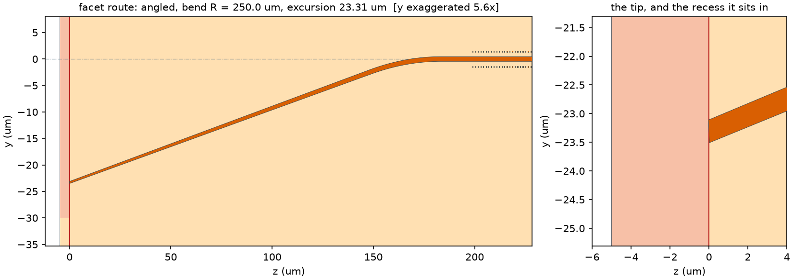

**Figure 11 — the guide where it reaches the die edge.** Read back from the GDS
that was written. The die edge is perpendicular and the guide meets it at 8°,
by a straight run of 150 µm that carries the taper and a 250 µm arc that returns
it to the die axis. The route consumes 183.334 µm along the die and moves
23.309 µm across it, and the Bragg posts begin at 198.427 µm. **The left panel is
not to scale**, the window being some six times longer than it is wide, so the
8° will not measure 8° against a protractor. The pink band is the recess, the
5 µm the cleave or the polish removes.

Two things are visible here that no figure in the metric tree carries.

The taper is spent on the straight and the guide enters the arc at its full
0.90 µm. That ordering is deliberate. A narrow guide is the one that radiates in
a bend, and the 0.40 µm tip would be the worst possible thing to turn.

The right panel is the tip magnified, and it shows a defect this document did not
previously record. **The guide begins at the die edge and does not extend into
the recess.** The end face is cut across the guide's own axis, so it stands 8°
from the die edge and spans z = −0.028 to +0.028 µm, which is 56 nm inside a 5 µm
band. A polish landing anywhere short of z = 0 leaves no guide at the facet at
all. The recess exists precisely so that the guide may be carried through it and
the polish may land in the middle of a guide rather than at its end. Carrying the
lead-in across the band is outstanding work and is not done here.

#### The die, checked

Run `20260808-100129-DIE20` assembles the 20.2 mm die with every grating period
drawn, the frame, the split ladder, the monitors and the density survey, and
checks it against both engines. The design verdict is PASS on twelve of twelve
targets and the five declared rules report no violation. The foundry runset
reports 3168 violations in six categories, and they do not mean what a single
total suggests.

| category | count | what it is |
|---|---:|---|
| `RIDGE outside CHIP_INNER` | 3072 | artefact of the layer mapping |
| `M1 outside CHIP_INNER` | 47 | artefact of the layer mapping |
| `RIB_MARKERS outside CHIP_INNER` | 20 | artefact of the layer mapping |
| `RIB_MARKERS - RIDGE separation (15.0um)` | 16 | **a real violation** |
| `RIB min. feature size violation (0.25um)` | 10 | **a real violation** |
| `CHIP_OUTER - CHIP_INNER enclosure` | 3 | not exercised, no frame drawn |

**The 3139 enclosure violations are an artefact and must not be counted.**
`CHIP_INNER` is mapped to the chain's `FLOORPLAN`, which at device level is the
device bounding box. A die carries the device, the ladder copies and the monitors
across the whole 20.2 mm, and every one of them lies outside the single device
floorplan that `FLOORPLAN` describes. The mapping is right at device level, where
it caught the bond pads, and wrong at die level. It is the same class of error as
the collision it replaced, and it is resolved by the reticle drawing a true chip
frame rather than by adjusting the count.

**The twenty-six that remain are real, and both were invisible to the five
declared rules.**

The ten ridge-width violations lie at x between 5.0 and 9.7 µm and span 60 µm in
y, in pairs 0.2 µm apart at a 0.5 µm pitch. That is the critical-dimension
vernier, which draws line and space arrays at the widths declared for it, and the
narrowest of those is 0.20 µm. The foundry floor is 0.25 µm. The monitor was
drawn against the rule this design declares, and that rule is the more permissive
of the two, so a structure intended to measure the process would have been
refused with the mask.

The sixteen separation violations lie at the four alignment marks. A box-in-box
overlay mark nests its levels with a 3 µm clearance, and the two levels sit on
the chain's `MARK` and `WG` layers, which map to `RIB_MARKERS` and `LN_RIDGE`.
The runset requires 15 µm between those two layers. The nesting clearance is
therefore short by 12 µm. The chain's own check on this mark asks only that the
levels clear the clearance declared for them, which they do.

Both findings are in the die frame rather than in the device, and neither is a
consequence of any design decision recorded in this document. Both are the
product of monitor and frame geometry drawn against declared rules that were
looser than the process allows. Neither is corrected here.

One further constraint is carried by the frame. The docstring states that only
the edge couplers routing to the chip facet may be placed in the exclusion ring,
which is 50 µm wide. The facet keep-out declared here is 30 µm.

#### The facet, and how the guide reaches it

The angled facet may be realised in two ways, and `layout.facet_route` selects
between them. Under `sheared` the guides remain parallel to the die axis and the
end face itself is cut at 8° to the whole array. No bend is required and no
lateral excursion is incurred. Under `angled` the die edge is perpendicular and
each guide is routed to meet it at 8°, by a straight run at that angle followed
by a circular arc back to the die axis.

The taper is carried on the angled straight and the arc is entered at full
width. That ordering is deliberate. A 0.4 µm tip is what radiates in a bend, so
the mode is expanded before the guide turns. The two rails are offset
perpendicular to the local heading, so the drawn width is the guide width
measured across its own axis. A sheared rectangle would be wrong there by
1/cos θ.

At a 150 µm taper and a 500 µm radius the route consumes 218.1 µm along the die
axis and 25.7 µm across it. Against the published 143 µm device pitch that
excursion is a sixth of the pitch, so the array spacing must carry it.

Every figure here is measured back off the emitted mask. The lead-in is drawn as
66 vertices spanning 0 to 218.128 µm in z and reaching 25.940 µm across, and the
recorded excursion is 25.742 µm. At the die edge the two rails are separated by
0.3961 µm in y, which is 0.4000 µm times the cosine of 8°, so the width across
the guide's own axis is the declared tip width. The guide arrives on the die axis
to within 5 × 10⁻² µm, so nothing downstream of the lead-in is displaced. The
input facet band spans 5.000 µm in z, which is the declared recess depth and
confirms the end face is square. Under `sheared` the same band spans 8.9 µm,
which is the recess plus the shear.

Two quantities that the axial extent alone would get wrong are carried
separately. The optical path from the facet to the grating is 219.813 µm, being
the 150 µm straight plus the 69.813 µm arc, against the 218.128 µm the route
advances. The cavity stage computes its round-trip delay from that path, so the
arc is deducted from `cavity.feed_length_um` rather than the chord. A feed
shorter than the path is refused rather than clamped. The slab and the floor plan
are sized off the excursion as well as off the electrodes, since a lead-in
outside the etch-clear region would be a guide with no cladding.

#### The radius at which a bend stops being a straight guide

Run `20260807-155538-BEND2` solved the bend modes by conformal transformation at
six radii.

| radius | caustic | Δn_eff from straight | lateral shift | |
|---:|---:|---:|---:|---|
| 150 µm | 11.808 µm | 1.3 × 10⁻⁴ | 0.020 µm | solved |
| 100 µm | 7.881 µm | 3.0 × 10⁻⁴ | 0.029 µm | solved |
| 70 µm | 5.529 µm | 6.1 × 10⁻⁴ | 0.043 µm | solved |
| 50 µm | 3.93 µm | — | — | refused |
| 35 µm | 2.75 µm | — | — | refused |
| 25 µm | 1.97 µm | — | — | refused |

At and below 50 µm the radiation caustic falls inside the computational window,
whose edge sits at 4.57 µm. The transformation there returns a state bound to
the window wall rather than a mode, and the stage refuses to answer instead of
reporting a number. A leaky-mode or time-domain solve is required at those
radii. The tightest radius solved is therefore **70 µm**, and the 500 µm radius
the routing uses sits seven times above it. The bend is not a constraint on this
design.

#### The recess follows the facet plane

The band that a cleave or a polish removes is drawn on its own layer so that
nothing is placed where it will be destroyed. That band was drawn axis-aligned
while the facet plane itself was sheared, so the two disagreed across nearly the
whole 5 µm depth. It now shears with the facet. Measured off the mask written by
run `20260807-155236-RECESS`, the input facet plane runs from (−4.716, −30) to
(3.716, 30) and the recess band from (−9.216, −30) to (−0.784, 30), both at
8.0°, the band remaining 5 µm deep across the full ±30 µm keep-out. At the output
facet, where the angle is zero, both remain square.

---

## 6.12 Every stage, and what each returned

§3.1 records the **baseline's** nine stages. This section records the
**candidate's** seventeen, which is the whole of what the chain offers. It is
generated from run `20260811-081705-COMPLETE`, a single execution of the entire
flow in 13.4 minutes, so no figure here is stitched together from separate runs.

A stage absent from a report is a question nobody asked, and it reads exactly
like a question answered favourably. The table therefore lists every stage
whether or not it found anything.

| stage | cost | what it returned |
|---|---:|---|
| `mode` | 68.7 s | one guided mode; n_eff 1.7815, n_g 2.2136 |
| `taper` | 314.2 s | adiabaticity margin **4.53** against a floor of 3.0; converged to 1e-15 |
| `fem` | 55.5 s | an independent solver agrees to **2.8e-4 relative**; polarisation purity 0.996 |
| `fdtd` | 10.1 s | band-gap kappa **1.184x** the coupled-mode value, converged; reused from `BANDS855` |
| `bend` | 92.0 s | tightest radius solved **100 um**; the route uses 250 um |
| `facet` | 13.7 s | **3.13 dB**, overlap 0.486; alignment tolerance 0.72 um for 1 dB |
| `grating` | 0.0 s | kappa 1.479 /cm, R 0.833, bandwidth 9.49 GHz, period 1302 nm |
| `eo` | 5.0 s | overlap 0.354, mirror tuning 613.1 MHz/V, Vpi.L 11.04 V.cm |
| `cavity` | 0.1 s | Pockels lever 0.631, tuning range 12.0 GHz, linewidth 4.95 kHz, SMSR 50.5 dB |
| `dynamics` | 0.0 s | threshold 30.6 mA, feedback regime V, margin 32.5 dB |
| `circuit` | 4.8 s | the chip sees **0.408** against the mirror's 0.833; etalon ripple **5.3 %** |
| `layout` | 7.6 s | 8451 periods drawn, every one of them; two writers agree exactly |
| `reticle` | 0.1 s | die 20200 x 5050 um, a footprint the process offers, frame centred |
| `drc` | 5.4 s | 5 declared rules **0**; the LN-CORE foundry runset **0** |
| `mask` | 229.1 s | 19954 regions and 19990 nets, both as declared; fill placed, every tile in window |
| `verify` | 0.0 s | **PASS, 12 of 12** |
| `release` | 0.5 s | **10 of 10** readiness conditions, nothing waived |

**Three of these stages are reported nowhere else in this document, and each
found something.**

**`fem` is the cross-check the finite-difference solver cannot perform on
itself.** A different solver, on a conforming triangulation of 3376 elements,
full-vectorially, returns n_eff 1.78100 against 1.78150 — a relative difference
of 2.8e-4. That bounds a class of error no amount of refining the first solver
would reveal. Its polarisation purity of 0.996 is the quantity bounding the
semi-vectorial assumption the whole chain rests on.

**`fdtd` produced the principal result of the exercise**, and it is set out in
`TOOLCHAIN_VALIDATION.md`: the band gap gives kappa 1.184 times the coupled-mode
value on the identical structure, converged, with no radiation channel to explain
it. §6.2.1 and §6.11 record what that measurement cost this design.

**`circuit` measured something the cavity model cannot express.** The cavity
stage applies the mirror at a single plane. The assembled circuit shows the gain
chip actually sees a peak reflectivity of **0.408**, roughly half the mirror's
0.833, and an etalon ripple of **5.3 %** across the stop band from the residual
facet reflection. The threshold and side-mode margin in §6.4 are therefore
evaluated against a mirror both stronger and smoother than the real one. The
assembly reproduces the closed-form two-mirror result to 3e-14 where the two are
comparable, so the difference is the facet and not the method.

## 7. The Verdict

**There are two verdicts, and this section gives both.** The table immediately
below is the **candidate**, which is the design this repository carries forward.
The table after it is the **baseline**, which reproduces the published geometry
and fails, and whose failure is the finding of the exercise rather than a defect.

Each row was written into the design file **before** the chain was run, and each
cites the published figure from which it was drawn. A target of severity `must`
sets the verdict; a target of severity `should` is recorded and counted, and does
not.

### 7.1 The candidate — PASS, 12 of 12

From run `20260811-081705-COMPLETE`, all seventeen stages in one execution.

| metric | criterion | result | severity | status |
|---|---|---:|---|---|
| guided modes | ≤ 1 | 1 | must | pass |
| Bragg wavelength | 1545.9 nm ± 2 % | 1546.4 nm | must | pass |
| peak reflectivity | 0.75 ± 20 % | 0.833 | must | pass |
| mirror bandwidth | 5 to 14 GHz | 9.49 GHz | should | pass |
| mirror tuning | 550 MHz/V ± 30 % | 613.1 MHz/V | must | pass |
| Vπ·L at Γ = 1 | 4.0 V·cm ± 25 % | 3.905 V·cm | should | pass |
| light on the metal | ≤ 1 × 10⁻⁵ | 1.55 × 10⁻⁹ | must | pass |
| **mode-hop-free range** | **≥ 8 GHz** | **12.01 GHz** | should | **pass** |
| linewidth | 2.8 kHz ± 100 % | 4.945 kHz | should | pass |
| SMSR | ≥ 40 dB | 50.5 dB | should | pass |
| DRC violations | ≤ 0 | 0 | must | pass |
| every period drawn | yes | yes | info | pass |

Beyond the targets: the LN-CORE foundry runset reports **0 violations** against
the assembled die, the `release` stage meets **10 of 10** readiness conditions,
and the corner sweep of §6.9 passes **9 of 9**.

Two of these are tight and §6.9 gives the corner figures. Peak reflectivity
reaches 0.887 against a bound of 0.90, and the linewidth 5.383 kHz against 5.6,
at their worst corners.

## 8. Warnings Raised

Two conditions were reported that no target tests. They are shown on every run
because a failure mode that does not present as a failed target is the kind that
is missed.

1. **The grating is unapodised**, so its sidelobes will appear as mode-hop risk
   and as sweep non-linearity.
2. **The mode-hop-free range of 4.59 GHz falls below the 10 GHz sweep required**,
   so the laser will hop part-way through a sweep.

---

## 9. Assumptions

Every quantity below is annotated `# ASSUMPTION:` in `design.yaml`. None is drawn
from the paper, and each is a first candidate for replacement by measured data.

| assumption | value adopted | what it affects |
|---|---|---|
| sidewall angle | 77° | Δn_eff, and hence κ, by 35 % against the 90° previously carried; also displaces λ_B by 4.3 nm. Sourced to an open foundry kit for the same stack rather than to the paper, so it remains an assumption about this device |
| RSOA length | 1000 µm | the Pockels lever, and hence both tuning rate and sweep range |
| RSOA group index | 3.6 | as above |
| feed waveguide length | 1000 µm | as above |
| RSOA internal loss | 10 cm⁻¹ | the threshold gain, and hence the linewidth |
| linewidth enhancement α | 3.0 | the linewidth, as (1 + α²) |
| spontaneous emission factor n_sp | 2.0 | the linewidth and the SMSR |
| propagation loss | 0.2 dB/cm | second-order here |
| electrode width | 20 µm | capacitance and drive bandwidth only |
| input taper length | 150 µm | the drawn straight run, and hence the mask. The paper states that a bi-layer taper is used and quotes no length; the reference it cites for that design gives 120 µm in the rib and 450 µm in the slab. The 1000 µm facet-to-grating distance is unaffected, being declared separately |
| differential gain | 2.5 × 10⁻¹⁶ cm² | the threshold current, the output power and the relaxation oscillation |
| transparency carrier density | 1.0 × 10¹⁸ cm⁻³ | the threshold current |
| carrier lifetime | 1.0 ns | the threshold current and the damping |
| gain compression | 1.5 × 10⁻¹⁷ cm³ | the damping, and hence the modulation bandwidth |
| spontaneous coupling β | 1.0 × 10⁻⁴ | the intensity noise |
| injection efficiency | 0.80 | the threshold current and the slope efficiency |
| active stripe | 2.0 × 0.10 µm | the active volume, and hence the threshold current |
| drive current at the operating point | 150 mA | the power, the noise and the relaxation oscillation reported in §6.5 |

The eight carrier parameters are ordinary values for a 1550 nm InP
multiple-quantum-well ridge. They are properties of a part rather than of the
photonic design, and a gain chip is bought against a datasheet. The feedback
margin of 36.8 dB in §6.5 is the one result of that section which does not
depend on any of them, resting on the two reflectors alone.

---

## 10. What This Report Does Not Establish

Stated so that coverage is not assumed where it is absent.

- **Components other than the taper are not simulated.** Multimode couplers and
  the facet interface have no geometry description in the chain; their loss
  figures are assumptions. Bends are covered only as far as the radius at which
  the mode ceases to be bound; no loss per turn is produced.
- **The mask reported above carries the device alone.** Every grating period is
  drawn, so the geometric counts describe the device that was simulated, and the
  `layout.mask_is_complete` row records it. What is absent is the die: no frame,
  no monitors and no fill. Those are produced by a different invocation, given
  in §11, and what that die does and does not carry is set out in §12.
- **The electrode model is quasi-static.** A travelling-wave model is present
  and gives the microwave index, the impedance, the conductor loss and the
  electro-optic bandwidth; the lumped RC figure is retained beside it and is
  known to understate a long electrode by an order of magnitude, which the run
  warns about. What neither carries is the microwave field pattern, the
  substrate mode or radiation from the line, for which a microwave eigenmode
  solve is required.
- **The mirror the cavity model applies is smoother than the one the laser
  sees.** The cavity stage applies the mirror at a single plane. The circuit
  assembly of §13 shows that the residual facet reflection, at 10⁻⁴ in power,
  modulates the effective mirror by 2.7 % across the stop band. The threshold
  and the side-mode margin in §6.4 are therefore evaluated against a mirror
  carrying no such ripple.
- **No thermal, stress or acoustic model exists.** The acoustic resonances
  measured in the reference paper are not predicted.
- **The laser model is single-mode and steady-state.** The rate equations of
  §6.5 make the carrier density a dynamical variable and thereby produce the
  threshold current, the light-current curve, the intensity noise and the
  feedback regime. They are solved at the steady state, and no differential
  equation is integrated. Mode competition, mode partition and the transient
  during a chirp ramp are therefore outside them. The SMSR figure scales with an
  assumed n_sp and is to be read as an ordering between designs rather than as
  an absolute value.
- **The gain chip is described by assumptions throughout.** Its length, group
  index, internal loss, linewidth enhancement factor and every carrier parameter
  under `cavity.rsoa.gain` are ordinary values for an InP ridge rather than the
  figures of a selected part. The threshold current of 77.8 mA and the 11.98 mW
  at 150 mA follow from them and move with them. What does not move with them is
  the feedback margin of 36.8 dB, which depends only on the two reflectors.
- **The coupling constant disagreed with the published device by a factor of
  2.15. A converged measurement now accounts for 1.42 of it, and the remaining
  1.51 has a reading rather than a measurement.** The finite-element cross-check
  confirms the index modulation to 2.0 %, so the error is not in the mode solve.
  The photonic band gap, which assumes nothing about the longitudinal profile,
  gives 0.702 of the coupled-mode value with its convergence guard passing by a
  factor of 6.5, and §6.2.1 recorded a 57.1 nm smoothing length, since withdrawn
  in §6.11, that was thought to reproduce
  it. The residual 1.51 is what a post gap of 700 nm would produce in place of
  the 630 nm quoted, and both mirror targets are met exactly at that gap. That
  is a reading of the evidence and not an independent observation of the
  fabricated dimension. The `cd_vernier` monitor and the κ ladder of §11 are
  what would settle it on a returned wafer.
- **The material data is public rather than measured.** Entries requiring
  confirmation are reported on every run.

---

## 11. The Mask as a Submission

The mask of §5 is the complete device and is checked as such. It is still not
something that could be sent anywhere, because it carries no frame, no process
control structures and no fill. A die is assembled by a second invocation, given
in §13.

The result, in approximately 180 s:

| quantity | value |
|---|---|
| grating periods drawn | 5665 of 5665 |
| device extent | 8410 × 207 µm |
| die extent | 8660 × 4142 µm |
| devices on the die | 6, being the design and a five-step ladder |
| die label | `EDBR_TFLN_BASELINE REVA`, rendered as polygons |
| seal ring | closed, 20 µm wide |
| dicing lane | 80 µm, drawn as a keep-out |
| overlay marks | four corners, nested between the guide and metal levels |
| manufacturing grid | 1 nm, every vertex verified on it after merging |
| rule violations, on the die | 0 |
| the two mask writers | agree exactly; exclusive-or residual 0.00 µm² |
| geometry conditions a deck does not check | 0 |
| extracted nets | 71,096 |
| fill placed | 212,627 elements, 849,271 µm²; every tile inside its window |

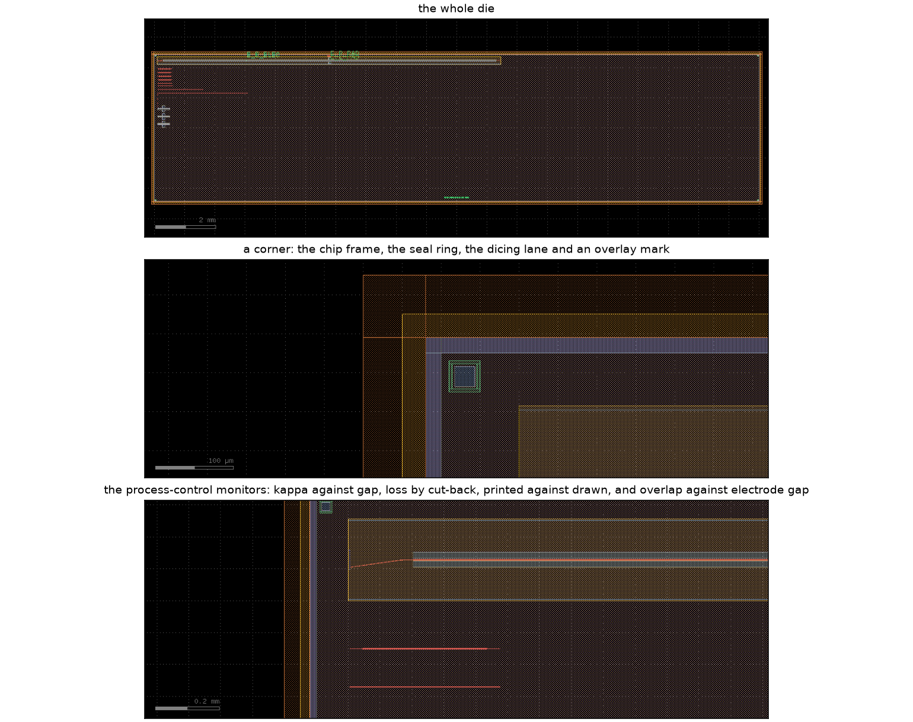

**Figure 14 — the assembled die, as the layout viewer draws it.** Rendered by
<span style="color:#1a73e8"><strong>KLayout</strong></span> from the die GDS with
the fill placed. Every item here is drawn by the `reticle` and `mask` stages and
appears in no other figure, and a frame that is never shown is a frame taken on
trust.

**The whole die**, 20200 × 5050 µm. The device runs along the top; the monitor
field sits below its left end; everything else is fill, 728 318 elements of it.

**A corner**, showing the four bands the die edge carries: the chip frame, the
seal ring that arrests a saw crack, the dicing lane, and one of the four
box-in-box overlay marks. The mark is on the marker layer alone: it was drawn on
the ridge layer as well until 2026-08-10, which put it 3 µm from a layer the
runset requires to stand 15 µm clear.

**The process-control monitors.** Four structures measuring what the chain
assumes: κ against post gap over five rungs, propagation loss by cut-back over
three lengths, printed critical dimension against drawn over four widths, and
electro-optic overlap against electrode gap over three gaps. They are the only
means by which the delivered process can be compared with the model that
predicted it.

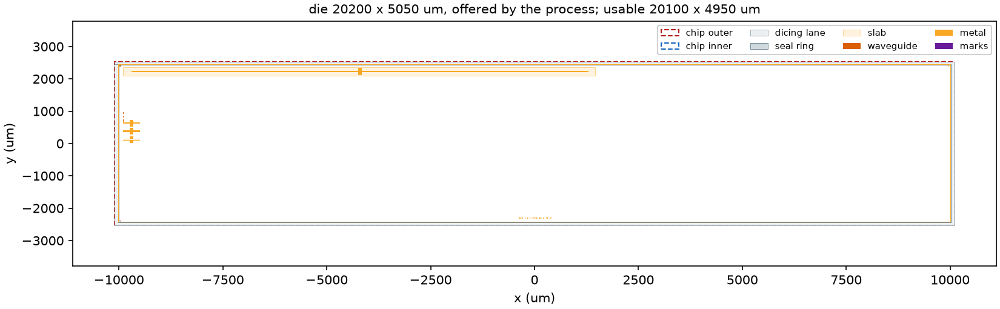

**Figure 13 — the die as emitted, 20200 × 5050 µm.** Read back from the die GDS.
The red dashed rectangle is `CHIP_OUTER`, the final chip boundary, and the blue
dashed one is `CHIP_INNER`, the usable area inset by the 50 µm exclusion ring.
Neither existed before 2026-08-09, and while they did not exist the runset's
footprint, centring and enclosure rules had nothing to compare and reported
nothing. The footprint is one of the three the process offers and the boundary
sits on the origin, both of which the runset now checks rather than assumes.

The die is largely empty, and that is a true report rather than a drafting
omission. The device is 11.35 mm on a 20.1 mm usable dimension, because the
process offers 5.05, 10.1 and 20.2 mm and nothing between. §6.10 records why the
middle size was rejected. No step and repeat is performed by this stage, so the
array of devices the paper places along the 5 mm edge is not drawn.

The figure below it is a hand-drawn schematic and predates the 20.2 mm die. It is
retained for the arrangement it shows and **its dimensions are superseded**.

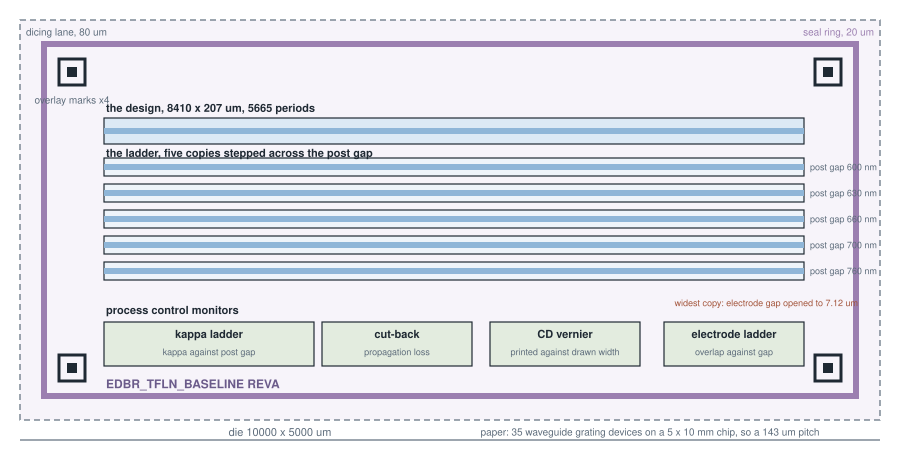

**Figure 8 — the die, as assembled.** The design sits at the top, the ladder of
five copies below it, and the monitor field below that, inside a seal ring and a
dicing lane with an overlay mark at each corner. The widest copy of the ladder
required its electrode gap opened to 7.12 µm, which is annotated because that
copy is then no longer the design with one parameter moved. Not to scale: the
device is 8410 × 207 µm, so at true proportions it would be a hairline.

### The ladder, and why it is there

Five copies of the device are placed below the primary one, stepped across the
post gap from 600 to 760 nm. The reason is quantitative rather than cautious.
The coupling constant presently disagrees with the published device by a factor
of 2.15, and the mode-hop-free range moves by 189 % across the declared process
window. A reticle carrying one copy stakes the whole fabrication run on the
model being right about a dimension the model is known to be wrong about.

One compromise is reported rather than concealed. The widest copy required its
electrode gap to be opened from 7.00 to 7.12 µm, the posts having moved outward
into the metal-to-guide clearance. That copy therefore differs from the primary
device in two parameters rather than one, and its electro-optic overlap is
lower.

### The monitors

Four families of structure are drawn beside the devices. Each isolates one cause
of a disagreement between a returned wafer and the prediction above.

| structure | what it measures | why it is on this die |
|---|---|---|
| κ ladder, five gaps from 530 to 730 nm | κ against post gap, on the delivered process | §6.6 shows the continuous tuning range moving by a factor of five across an ordinary window, driven by this one dimension |
| cut-back, three straight guides | propagation loss, with the coupling loss as the intercept | the 0.2 dB/cm in the design file is an assumption |
| critical-dimension vernier, five widths | the printed width against the drawn one | this is the measurement that replaces the assumed lithographic bias of §"the three misses" |
| electrode ladder, three gaps | electro-optic overlap against electrode gap | Γ = 0.373 is computed and has never been measured |

The electrode ladder could not be drawn at every gap requested: 4 µm was raised
to 5 µm, the metal-to-guide rule setting the floor against a 1 µm guide. The
tightest gap the ladder reaches is therefore wider than the design uses.

### What is emitted

| file | content |
|---|---|
| `<name>.die.filled.gds` | the die with the fill placed. This is the deliverable |
| `<name>.die.gds` | the same die before fill |
| `<name>.gds`, `<name>.oas` | the device cell alone, in both formats |
| `<name>.lyp`, `<name>.layermap.txt` | the layer table, as <span style="color:#1a73e8"><strong>KLayout</strong></span> properties and as a plain map |
| `MANIFEST.json`, `MANIFEST.md` | the inventory, the checksums and the readiness |

The OASIS and the GDS carry identical geometry, verified by exclusive-or across
every layer. The OASIS is 5.4 kB against 726 kB, the periodic grating collapsing
into a repetition record. A third file, `<name>.gdsfactory.gds`, exists so that
the two independent writers can be compared and is not a deliverable.

### The release gate

The manifest asserts that a set of files is ready to be sent, so the conditions
of that claim are evaluated rather than assumed. **Eight of ten are met.** The
run is blocked on two:

* **the foundry rule deck was not executed until 2026-08-08.** The five
  declared rules are a smoke test. The LN-CORE lnoi400 runset has since been
  obtained and is executed against the emitted mask; §6.10 records what it
  found. The die-level checks it carries remain unexercised, the die footprint
  being non-compliant.
* **the acceptance targets are not met.** The verdict is FAIL on the
  reflectivity row, which is the intended product of this exercise and is
  analysed in [TOOLCHAIN_VALIDATION.md](TOOLCHAIN_VALIDATION.md).

  This condition applies to the baseline. The candidate returns PASS on all
  twelve targets and is not blocked on it.

Either may be waived by name, and a waiver is recorded in the manifest beside
the condition rather than removing it.

## 12. What the Die Still Lacks

- **The die footprint is not one the process offers.** 12500 x 5000 um matches
  none of the three admissible dimensions, and the device is too long for the
  middle one. A compliant die is 20000 x 5000 um nominal. Until the die is
  changed, the footprint, centring and enclosure rules cannot be exercised.
- **The layer table was nominal until 2026-08-08** and collided with the
  foundry numbering. It now carries the foundry numbers. Mask polarity is still
  not expressed.
- **The layer table is nominal.** Placeholder numbers are used. Mask polarity
  can now be expressed, `layout.derived_layers` producing an inverse tone as a
  field minus a feature, but no such layer is declared here because the process
  that would require one has not been selected.
- **The fill pattern is a placeholder.** The placer works and brings every tile
  inside its window; the element size, the pitch and the stand-off it was given
  are assumptions until a foundry states them.
- **No device is recognised.** Connectivity is extracted, named from the labels
  and compared against a declared schematic, which establishes that the things
  declared to be one net are one net. It does not establish what the connected
  thing is, so a short through the wrong component would present as a correct
  net.
- **No step and repeat.** One die is assembled; arraying it across a reticle
  field is a foundry operation carried out against their frame.
- **No submission paperwork.** Mask tone per layer as a foundry states it, the
  wafer and die counts, and the submission form itself are absent. The chain has
  never seen one.

## 13. Reproduction

```bash
cd design-chain

# the full default chain, approximately 50 s
./.venv/Scripts/python.exe -m picchain.cli run ../examples/edbr_tfln_baseline/design.yaml

# the two optional stages, taken separately on account of their cost
./.venv/Scripts/python.exe -m picchain.cli run ../examples/edbr_tfln_baseline/design.yaml \
    --stages taper --set taper.enabled=true
./.venv/Scripts/python.exe -m picchain.cli run ../examples/edbr_tfln_baseline/design.yaml \
    --stages fdtd  --set fdtd.enabled=true

# the process window rather than the nominal point
./.venv/Scripts/python.exe -m picchain.cli corners ../examples/edbr_tfln_baseline/design.yaml

# an independent kappa, from the photonic band gap
./.venv/Scripts/python.exe -m picchain.cli run ../examples/edbr_tfln_baseline/design.yaml     --stages fdtd --set fdtd.enabled=true --set fdtd.structure=bandstructure

# the bend modes, and the radius at which a bend starts to radiate
./.venv/Scripts/python.exe -m picchain.cli run ../examples/edbr_tfln_baseline/design.yaml     --stages bend --set bend.enabled=true

# the cross-section by an independent numerical method
./.venv/Scripts/python.exe -m picchain.cli run ../examples/edbr_tfln_baseline/design.yaml \
    --stages mode,fem --set fem.enabled=true

# the passive circuit assembled from scattering matrices
./.venv/Scripts/python.exe -m picchain.cli run ../examples/edbr_tfln_baseline/design.yaml \
    --stages circuit --set circuit.enabled=true

# the die of section 11: every period, the frame, the ladder, the monitors,
# the fill placed, the die checked, and a manifest of what results (~180 s)
./.venv/Scripts/python.exe -m picchain.cli run ../examples/edbr_tfln_baseline/design.yaml \
    --set layout.draw_periods=null --set layout.require_complete=true \
    --set reticle.enabled=true --set reticle.split.enabled=true \
    --set drc.target=die --set mask.target=die \
    --set mask.fill.enabled=true --set release.enabled=true

# the emitted mask against its stored reference
./.venv/Scripts/python.exe -m picchain.cli golden ../examples/edbr_tfln_baseline/design.yaml

# regenerate this report's figures without re-simulating
./.venv/Scripts/python.exe -m picchain.cli report ../examples/edbr_tfln_baseline/design.yaml
```

The mask is inspected interactively with `tools\view_mask.cmd examples\edbr_tfln_baseline`.

The mask is opened in the <span style="color:#1a73e8"><strong>KLayout</strong></span> application with the rule-violation markers
loaded alongside it. Pointing **File → Setup → Layer Properties** at the emitted
`<name>.lyp` gives each layer its name rather than a bare number.

**Environment of the run reported:** python 3.13.9 on Windows 11, <span style="color:#1a73e8"><strong>numpy</strong></span> 2.4.6,
<span style="color:#1a73e8"><strong>scipy</strong></span> 1.18.0, <span style="color:#1a73e8"><strong>klayout</strong></span> 0.30.10, <span style="color:#1a73e8"><strong>gdsfactory</strong></span> 9.47.0, <span style="color:#1a73e8"><strong>femwell</strong></span> 0.1.12, <span style="color:#1a73e8"><strong>gmsh</strong></span> 4.15.2,
<span style="color:#1a73e8"><strong>sax</strong></span> 0.18.2, <span style="color:#1a73e8"><strong>matplotlib</strong></span> 3.11.1. <span style="color:#1a73e8"><strong>meep</strong></span> 1.34.0 in a separate environment for the
time-domain stage.

## Further Reading

| document | content |
|---|---|
| [TOOLCHAIN_VALIDATION.md](TOOLCHAIN_VALIDATION.md) | the comparison against the published measurements, and the analysis of the three misses |
| [`../../design-chain/PICCHAIN_REFERENCE.md`](../../design-chain/PICCHAIN_REFERENCE.md) | what each stage computes, by what method, and what the chain does not compute |
| [`../../design-chain/PICCHAIN_REFERENCE.md`](../../design-chain/PICCHAIN_REFERENCE.md) | what each stage computes, by which method and with which tool |
| [`../../docs/design_simulation_verification_flow.md`](../../docs/design_simulation_verification_flow.md) | the methodology and the toolset survey |
