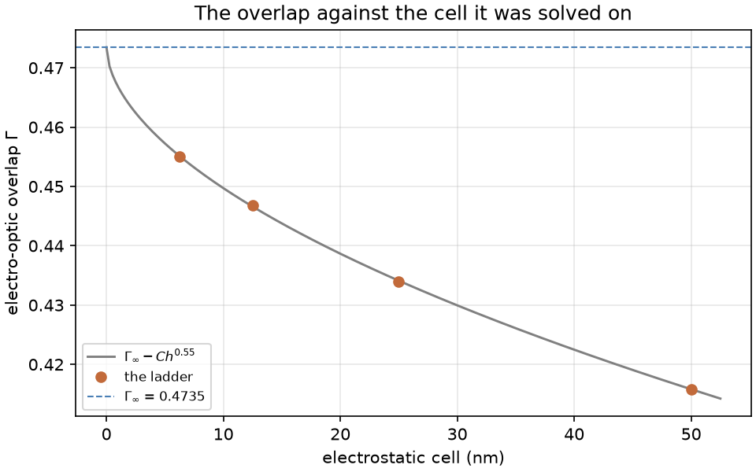
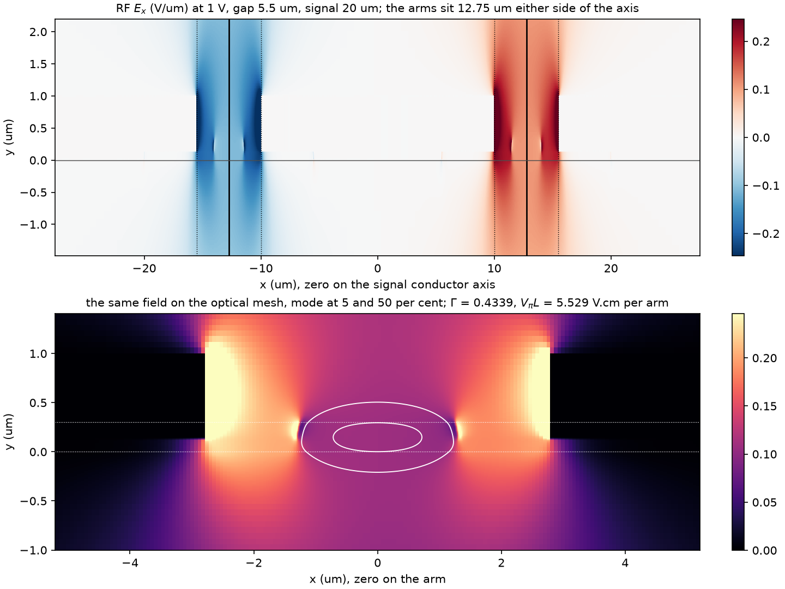
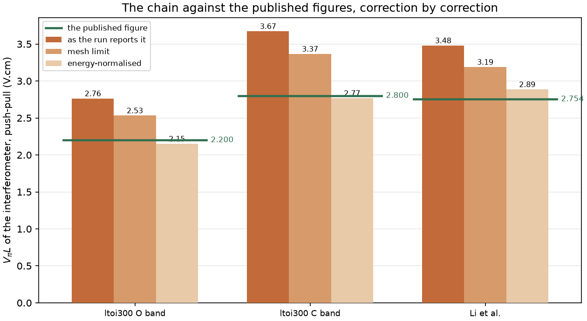
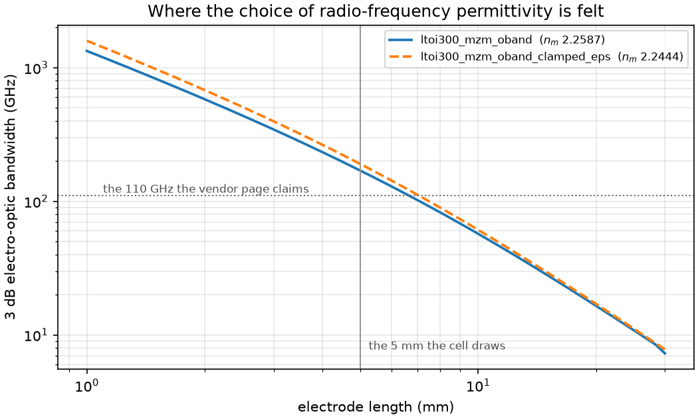

# The LTOI300 travelling-wave modulator: what its half-wave voltage is, and which permittivity the chain should carry

A study of the Mach-Zehnder modulator cells of the Luxtelligence LTOI300
process design kit, being `terminated_mzm_1x2mmi_oband` and its C-band
counterpart in
[`design-chain/pdk/lxt_pdk_gf/ltoi300/cells.py`](../../design-chain/pdk/lxt_pdk_gf/ltoi300/cells.py).
The geometry is taken from the open PDK and measured back off the drawn cell.
The material model is taken from the LT-PRO design manual, which is held under
the foundry's terms and is described under "The foundry material model" below.

The study was conducted on 2026-09-03 against chain revision `87a4d23`. The
drawn electrode, the termination and the as-drawn phase-shifter rows were added
on 2026-09-04, against a working tree carrying uncommitted changes to `rf.py`,
`config.py`, `stages/s03_eo.py` and `solvers/fdmode.py`.

## The two questions

**What is V<sub>π</sub>·L, and do the sources agree?** Three figures are
published for one geometry. The PDK compact model computes
`V_pi = 2 * 2.2e4 * wl / length / 1.31` in the O band, which is 8.8 V at the
5000 µm cell default and therefore 4.4 V·cm. The Luxtelligence vendor page,
recorded in [`references/README.md`](../../references/README.md), quotes about
2.2 V·cm in the O band. The LT-PRO design manual states r<sub>33</sub> of about
30 pm/V, and the half-wave figure is absent from it.

**Which radio-frequency permittivity should the chain carry?** The generic
library at
[`design-chain/pdk/materials.yaml`](../../design-chain/pdk/materials.yaml)
carries 40.9 across the c axis and 42.5 along it, from Bruner et al. The LT-PRO
design manual states 54 and 43. The difference of a third moves capacitance,
microwave index, impedance and therefore bandwidth.

## The geometry, measured off the cell rather than read from the source

Every geometric figure the design files declare is measured back off the drawn
polygons by
[`scripts/measure_pdk_cell.py`](scripts/measure_pdk_cell.py):

```bash
cd design-chain/pdk/lxt_pdk_gf
python ../../../examples/ltoi300_modulator/scripts/measure_pdk_cell.py
```

| Measured on a transverse cut through the modulation section | |
| --- | --- |
| Gap at a T-rail | 5.500 µm |
| Signal conductor at a T-rail | 20.000 µm |
| Ground plane at a T-rail | 50.000 µm |
| Gap between T-rails | 15.500 µm |
| Signal conductor between T-rails | 10.000 µm |
| Fraction of the 58 µm period at the narrow gap | 91.4 % |
| Modulation-section arm width | 2.500 µm |
| Arm displacement from the signal axis | 12.750 µm |
| Slab beyond each ridge edge | 6.000 µm |

The arm displacement equals half the signal width plus half the gap, which is
the centre line of the gap, and it is the placement the electro-optic stage
assumes for its `gsg` topology.

**The electrode is periodically loaded and one cross-section cannot represent
that.** For 8.6 per cent of its length the conductor recedes and the gap opens
to 15.5 µm. Weighting the reciprocal gap over one period, a model carrying only
the narrow gap overstates the mean field by 5.9 per cent, and this study
originally offered that as an upper bound.

**It is not a bound, and the reason is instructive.** Solving both drawn
cross-sections and homogenising them over the period, which
[`../ltoi300_mzm/scripts/trail_electrode.py`](../ltoi300_mzm/scripts/trail_electrode.py)
does, gives a half-wave voltage 6.7 per cent above the uniform figure in the O
band and 5.3 per cent above it in the C band, against the 5.9 and 4.7 per cent
the gap weighting predicts. The reciprocal-gap argument holds the overlap fixed
and the overlap does not hold: it falls from 0.4339 to 0.3347 in the wide-gap
section, which is a further 23 per cent, and the ratio of the two half-wave
voltages is the gap ratio times exactly that. **A geometric bound on a field is
not a bound on the quantity the field is integrated into.**

The homogenisation also returns what the gap weighting says nothing about. The
microwave index rises from 2.2587 to 2.2783 and away from the optical group
index, so the velocity mismatch worsens by a quarter and the 3 dB bandwidth
falls from 169.6 GHz to 144.4. The characteristic impedance rises from 41.91 Ω
to 44.00, which settles a question this study could not: the drawn electrode
does sit nearer 50 Ω than the unloaded cross-section returns, by 2.1 Ω. The figures for both bands are tabulated in the
[Mach-Zehnder study](../ltoi300_mzm/README.md).

What a two-section homogenisation still does not carry is the transition at each
rail edge, which is 0.5 µm of the 58 and is assigned here to the section it
adjoins. A three-dimensional electrostatic solve over one period would carry it.

## The foundry material model

The LT-PRO design manual states a single-resonance optical dispersion for
thin-film lithium tantalate and a radio-frequency permittivity of 54 across the
c axis and 43 along it. Those coefficients are held in an untracked foundry file
at `design-chain/pdk/LXT_LT_PRO/materials_lt_pro.yaml`, on the same terms as the
rule decks beside it, and the same file is used by
[`examples/ltoi300_ring/`](../ltoi300_ring/README.md), where the dispersion is
described in full.

A second untracked file, `materials_lt_pro_clamped_eps.yaml`, was written for
this study. It carries the manual's dispersion unchanged and the bulk congruent
permittivity of 40.9 and 42.5 that the generic library holds. Holding the
dispersion fixed and moving only the permittivity is what makes every shift
between the two sets of runs attributable to the permittivity, which is what
[`rules/generic/parameter-scans.md`](../../rules/generic/parameter-scans.md)
requires of a scan.

The metal is treated as bulk gold at 4.1 × 10<sup>7</sup> S/m and 0.9 µm thick.
The thickness is a declared assumption, the PDK drawing no metal thickness. The
manual states a sheet resistance for the first metal from which a thickness
follows, and that figure is recorded in the untracked foundry file. The two
thicknesses give the same bandwidth, the skin depth in gold sitting below either
of them above about 10 GHz, so the conductor loss is set by the skin depth and
by the conductor width alone.

## What was run

Five design files pose the modulator arm to the chain, and each carries the
`mode`, `eo`, `modulator` and `verify` stages.

| File | Purpose |
| --- | --- |
| [`design_oband.yaml`](design_oband.yaml) | The O-band arm on the manual's permittivity. This is the run of record |
| [`design_oband_clamped_eps.yaml`](design_oband_clamped_eps.yaml) | The same section on the clamped bulk permittivity |
| [`design_cband.yaml`](design_cband.yaml) | The C-band arm, 16 µm signal conductor, on the manual's permittivity |
| [`design_cband_clamped_eps.yaml`](design_cband_clamped_eps.yaml) | The same section on the clamped bulk permittivity |
| [`design_li_reference.yaml`](design_li_reference.yaml) | The measured modulator of Li et al., posed to the same stage as the anchor |

Execution, from the repository root:

```bash
picchain run examples/ltoi300_modulator/design_oband.yaml
```

The run tree is written to `runs/` beside the design files and is excluded from
version control.

Every run verifies. Every target in these designs is a `should`, so no `must` row was evaluated and the PASS attests to the `should` rows alone. The `should` targets encoding
the published half-wave figures stand 25 to 31 per cent above the claims as the
runs report them, and the whole of that gap is accounted for below.

## The convergence of the electrostatic solve, which is read before anything else

The overlap integral converges slowly in the electrostatic cell. The cause is
the sloped ridge sidewall, across which the permittivity steps by a factor of
eleven and which the raster staircases. A ladder of four cells was solved on the
O-band cross-section and fitted by
[`scripts/mesh_convergence.py`](scripts/mesh_convergence.py):

```bash
python examples/ltoi300_modulator/scripts/mesh_convergence.py \
    runs/<50 nm> runs/<25 nm> runs/<12.5 nm> runs/<6.25 nm> \
    --plot figures/mesh_convergence.png
```

The four runs are named in the register at the foot of this document.

| Cell | Γ | V<sub>π</sub>·L per arm | C (pF/cm) | n<sub>m</sub> | Z<sub>0</sub> (Ω) | f<sub>3dB</sub> (GHz) |
| --- | --- | --- | --- | --- | --- | --- |
| 50 nm | 0.41584 | 5.7691 | 1.7671 | 2.2499 | 42.469 | 183.29 |
| 25 nm | 0.43394 | 5.5286 | 1.7976 | 2.2587 | 41.911 | 169.56 |
| 12.5 nm | 0.44682 | 5.3692 | 1.7950 | 2.2517 | 41.842 | 178.18 |
| 6.25 nm | 0.45503 | 5.2723 | 1.7943 | 2.2484 | 41.799 | 182.44 |



Fitting Q(h) = Q<sub>∞</sub> − C h<sup>p</sup> to the overlap returns
Γ<sub>∞</sub> = 0.47346 at an order of 0.55, the figure at the finest cell
still being 3.9 per cent short of it. The half-wave voltage per arm extrapolates
to 5.0919 V·cm on the same fit. Reaching it instead through the overlap, the
half-wave voltage being inversely proportional to it, gives 5.0670 V·cm. The two
routes differ by half of one per cent, and the reconciliation below takes the
second of them, so that one factor carries the whole of the mesh correction.

Three of the six quantities are not monotone over the ladder and are therefore
not extrapolated. The capacitance moves over a spread of 1.7 per cent, the
microwave index over 0.46 per cent, and the 3 dB bandwidth over 7.7 per cent.
**The bandwidth is the least converged of the three because it is a difference
of two nearly equal numbers**: the microwave index is 2.2587 against an optical
group index of 2.1834, so a shift of 0.46 per cent in the first is a shift of 14
per cent in the velocity mismatch that sets the bandwidth. The characteristic
impedance converges cleanly, at an order of 2.62 and a residual of 0.02 per
cent.

Every run in this study is posed at 25 nm, so that the mesh error is common to
all of them and the ratio between any two is meaningful. The factor from the
overlap at 25 nm to the fitted limit is 1.09107, and it is applied explicitly
wherever it is used rather than folded into a reported number.

The convergence finding the stage raises is acknowledged by name in each design
file, with this ladder as the reason.

## Question 1: the half-wave voltage

### The factor of two is a convention, and the interferometer says so

The PDK compact model returns 8.8 V and the vendor page quotes 2.2 V·cm, which
over 5000 µm is 4.4 V. The two differ by exactly two.

The convention was settled by driving the model rather than by reading it.
[`scripts/pdk_pushpull_convention.py`](scripts/pdk_pushpull_convention.py)
sweeps the bias of the assembled interferometer and finds its extinction:

```bash
cd design-chain/pdk/lxt_pdk_gf
python ../../../examples/ltoi300_modulator/scripts/pdk_pushpull_convention.py
```

```
the expression in models.py returns V_pi = 8.8000 V at wl = 1.31 um and length = 5000.0 um
one arm at 8.8000 V accumulates 1.000000 pi relative to zero bias
the balanced interferometer extinguishes at V_dc = 4.4000 V, transmission 1.661e-25 of its peak
  consecutive nulls are 8.8000 V apart, which is twice the half-wave voltage and gives 4.4000 V
  the device half-wave voltage is therefore 4.4000 V, and the device V_pi.L is 2.2000 V.cm
  the single-arm half-wave voltage is 8.8000 V, and the single-arm V_pi.L is 4.4000 V.cm
  the ratio between them is 2.000000
```

The netlist hands `+V_dc` to one arm and `−V_dc` to the other, so the
differential phase accumulates at twice the single-arm rate and the device
reaches its half-wave point at half the single-arm voltage. The cell default
carries a 100 µm arm imbalance, which is a static phase; it is set to zero for
the sweep and the null-to-null spacing is reported as well, that spacing being
twice the half-wave voltage whatever static phase the device carries.

**The PDK compact model and the vendor page state the same number.** The model
quotes the arm and the page quotes the interferometer. Three sources therefore
become two, and the remaining question is whether 2.2 V·cm as a device is what
the geometry delivers.

### What the chain returns

At 25 nm, on the manual's material model:

| Quantity | O band, 1.31 µm | C band, 1.55 µm |
| --- | --- | --- |
| Extraordinary index | 2.15521 | 2.15205 |
| Group index of the mode | 2.18341 | 2.13473 |
| Intensity in the film | 72.98 % | 65.22 % |
| Electro-optic overlap Γ | 0.43394 | 0.38800 |
| V<sub>π</sub>·L per arm | 5.5286 V·cm | 7.3482 V·cm |
| V<sub>π</sub>·L of the interferometer | 2.7643 V·cm | 3.6741 V·cm |
| V<sub>π</sub> over the 5 mm cell | 2.7643 V | 3.6741 V |
| Optical power beyond the conductor edge | 2.2 × 10<sup>−8</sup> | 5.6 × 10<sup>−7</sup> |



The mode sits 2.75 µm from the nearest conductor and the metal absorption proxy
is eight orders below the threshold at which the stage warns. The propagation
loss of this arm is therefore set by the guide and by the process that etched
it.

### The two corrections that stand between the run and the claim

The run overshoots the claim by 25.7 per cent in the O band and by 31.2 per cent
in the C band. Two corrections account for the whole of it. Each is computed
independently of the published figures, one from a ladder of solves and the
other from the mode profile.

**The mesh.** The ladder above gives 1.09107 on the overlap at 25 nm. Applied,
the O-band interferometer figure falls from 2.7643 to 2.5336 V·cm.

**The normalisation of the perturbation integral.** The stage forms

```
Gamma  = (G/V) Int_film( E_rf |E|^2 ) / Int_all( |E|^2 )
dn_eff = Gamma * (1/2) n_e^3 r33 (V/G)
```

which weights the local index change by the optical intensity. First-order
perturbation theory for a guided mode weights it by the stored energy. Taking
the standard result dβ = (ω ε<sub>0</sub>/4) ∫ dε |E|² / P with P = v<sub>g</sub>U
and d(ωε<sub>r</sub>)/dω = 2 n n<sub>g,mat</sub>,

```
dn_eff = n_g n_e Int_film( dn |E|^2 ) / Int_all( n n_g,mat |E|^2 )
```

The two agree only where n<sub>g</sub>n<sub>e</sub> equals the intensity-weighted
mean of n·n<sub>g,mat</sub>, which holds for a mode wholly inside a
non-dispersive film. On a thin-film ridge a quarter of the mode sits in oxide,
where that product is under half its value in the film, so the two differ.
[`scripts/perturbation_normalisation.py`](scripts/perturbation_normalisation.py)
computes the ratio from the intensity map and the film mask the stage itself
wrote, with the indices evaluated by the chain's own material library:

```bash
python examples/ltoi300_modulator/scripts/perturbation_normalisation.py \
    runs/20260903-103807-ltoi300_mzm_oband
```

| Cross-section | ⟨n n<sub>g,mat</sub>⟩ | n<sub>g</sub>n<sub>e</sub> | Ratio |
| --- | --- | --- | --- |
| ltoi300 O band | 3.99643 | 4.70573 | 1.17748 |
| ltoi300 C band | 3.77714 | 4.59405 | 1.21628 |
| Li et al. | 4.16716 | 4.60478 | 1.10502 |

### The reconciliation



The figure was drawn on 2026-09-03 and plots the uniform electrode, being the
first of the two tables below.

The command that draws it, with every run named in full, is given in the
register at the foot of this document.

| Interferometer V<sub>π</sub>·L (V·cm) | ltoi300 O band | ltoi300 C band | Li et al. |
| --- | --- | --- | --- |
| As the run reports it | 2.7643 | 3.6741 | 3.4811 |
| At the mesh limit | 2.5336 | 3.3674 | 3.1905 |
| Energy-normalised | **2.1517** | **2.7686** | **2.8873** |
| The published figure | 2.2000 | 2.8000 | 2.7540 |
| Residual | −2.20 % | −1.12 % | +4.84 % |

**Every ltoi300 column above is the uniform electrode.** The drawn electrode is
periodically interrupted, as the section on the geometry sets out, and
homogenising it raises the half-wave voltage by 6.68 per cent in the O band and
5.31 in the C band. Applying that factor to the two ltoi300 columns:

| Interferometer V<sub>π</sub>·L (V·cm), the electrode as drawn | ltoi300 O band | ltoi300 C band |
| --- | --- | --- |
| As the run reports it | 2.9489 | 3.8692 |
| At the mesh limit | 2.7028 | 3.5462 |
| Energy-normalised | **2.2954** | **2.9156** |
| The published figure | 2.2000 | 2.8000 |
| Residual | **+4.34 %** | **+4.13 %** |

Read as the product r<sub>33</sub>Γ, which is what a half-wave figure actually
constrains:

| | Chain, both corrections applied | The electrode as drawn | Required by the published figure | Residual as drawn |
| --- | --- | --- | --- | --- |
| ltoi300 O band | Γ 0.55749, r<sub>33</sub>Γ 16.725 pm/V | 15.678 pm/V | 16.357 pm/V | −4.15 % |
| ltoi300 C band | Γ 0.51489, r<sub>33</sub>Γ 15.447 pm/V | 14.668 pm/V | 15.274 pm/V | −3.97 % |
| Li et al. | Γ 0.47808, r<sub>33</sub>Γ 14.582 pm/V | not applicable | 15.287 pm/V | −4.62 % |

The Li et al. row carries no correction, that device having a uniform electrode
and its own r<sub>33</sub> of 30.5 pm/V, declared in its design file.

**Three points settle the question.**

The vendor's 2.2 V·cm is the figure the physics supports, and the PDK compact
model states the same device once its push-pull convention is applied. The chain
returns 2.15 V·cm for the uniform electrode and 2.30 for the one the kit draws,
against a vendor figure of 2.2, so the vendor's number sits between the two.
**Which of the two the vendor's figure describes is not recoverable**, a vendor
quoting a half-wave voltage stating no cross-section, and the four per cent that
separates them is inside the spread of the corrections applied to reach either.

The manual's r<sub>33</sub> of about 30 pm/V is consistent with all of it.
Every row of the table above is reached with r<sub>33</sub> held at 30 pm/V,
except the Li et al. row, which uses the 30.5 pm/V its own design file declares, and
the overlap the chain computes is 0.5572 in the O band on the narrow-gap
section, which is the figure a 2.5 µm arm at a 5.5 µm gap should reach. The two
corrections are applied to that figure and the raw solve returns 0.43394; where
the rail is cut the raw solve returns 0.3347 and the corrected figure is 0.430,
and the two are not to be compared uncorrected.
[`rules/platform/thin_film_pockels/`](../../rules/platform/thin_film_pockels/README.md)
records Γ between 0.24 and 0.35, measured on 1 µm ridges at gaps of 6 to 8 µm.
Three things separate this cross-section from those. The arm is 2.5 µm wide and
holds 73 per cent of its intensity in the film. The gap is 5.5 µm against 6 to
8 µm. The figure quoted here carries the energy normalisation, and the recorded
range was taken on the intensity-weighted definition.

The corrections are common to two independent geometries. The ltoi300 cell and
the device of Li et al. differ in film thickness by a factor of two, in etch
depth by a factor of 2.4, in substrate, in cladding thickness, in wavelength and
in electrode length, and one figure is a vendor claim while the other is a
measurement. The same two corrections bring both within five per cent, which is
the independence that
[`rules/generic/independent-cross-checks.md`](../../rules/generic/independent-cross-checks.md)
asks for before a correction is believed.

**The normalisation correction is reported as a finding, and the chain still
carries the definition it always carried.** Stage 3 was left unmodified, that
being outside the scope of this study, and every number this report attributes
to the chain is the number the chain returned. What is
claimed here is that the residual between the chain and two independent
published figures is accounted for by a term whose magnitude is computed from
the mode profile rather than fitted. Adopting it would move the overlap, the
tuning efficiency in MHz/V and the half-wave voltage in proportion, and would
leave the capacitance, the impedance and the bandwidth untouched, those being
properties of the line rather than of the optical mode. The procedure in
[`rules/generic/corrections-and-fits.md`](../../rules/generic/corrections-and-fits.md)
applies before it is carried into the chain.

### The gap the cell draws is the gap the rule deck permits

The LT-PRO rule deck carries `M1.sep(RIDGE, 1.5 µm)`, recorded in
[`references/README.md`](../../references/README.md), and LN-CORE carries no
such rule. A 2.5 µm modulation arm therefore admits a minimum gap of
2.5 + 1.5 + 1.5 = 5.5 µm, which is exactly the gap the cell draws. **The
electrode gap of this cell is set by the rule deck.** It is therefore fixed
rather than chosen, and lowering V<sub>π</sub>·L by closing the gap requires
narrowing the arm by the same amount.

The two therefore move together, which is what
[`rules/generic/parameter-scans.md`](../../rules/generic/parameter-scans.md)
calls a field the process cannot move in isolation. They were scanned together,
the gap held at the arm width plus 3.0 µm at every point:

```bash
picchain run examples/ltoi300_modulator/design_oband.yaml \
    --set waveguide.top_width_um=1.5 --set electrodes.gap_um=4.5 \
    --set electrodes.convergence_check=false --stages eo,modulator
```

| Arm | Gap | Γ as reported | V<sub>π</sub>·L device, reported | Both corrections applied | Z<sub>0</sub> | Power beyond the conductor edge |
| --- | --- | --- | --- | --- | --- | --- |
| 1.0 µm | 4.0 µm | 0.35785 | 2.4379 V·cm | 1.8379 V·cm | 37.70 Ω | 8.7 × 10<sup>−7</sup> |
| 1.5 µm | 4.5 µm | 0.39161 | 2.5062 V·cm | 1.9267 V·cm | 39.20 Ω | 1.4 × 10<sup>−7</sup> |
| 2.0 µm | 5.0 µm | 0.41560 | 2.6239 V·cm | 2.0339 V·cm | 40.60 Ω | 4.7 × 10<sup>−8</sup> |
| 2.5 µm | 5.5 µm, as drawn | 0.43394 | 2.7643 V·cm | 2.1517 V·cm | 41.91 Ω | 2.2 × 10<sup>−8</sup> |

The normalisation factor was recomputed at every point, the film confinement
moving from 69.2 to 73.0 per cent across the scan; the mesh factor was
transferred from the O-band ladder.

**Narrowing the pair improves the half-wave figure by 14.6 per cent at a 1.0 µm
arm.** Two terms make that figure. The gap falls by 27.3 per cent and the
overlap by 17.5 per cent, and those oppose, leaving 11.8 per cent on the figures
the runs report. The normalisation supplies the remaining 3 per cent, the
narrower arm holding 69.2 per cent of its mode in the film against 73.0 per
cent, which raises the ratio between the two definitions.

Three costs stand against it. The characteristic impedance falls from 41.9 to
37.7 Ω, taking the return loss from 21.1 to 17.1 dB. The optical power beyond
the conductor edge rises by a factor of 40, and it remains four orders below the
threshold at which the stage warns. The propagation loss rises steeply, a 1.0 µm
ridge on a 300 nm film meeting its etched sidewall far more strongly than a
2.5 µm one, which is the scaling
[`examples/ltoi300_ring/`](../ltoi300_ring/README.md) establishes on this
platform. **The third cost decides the trade and it lies outside this chain**,
the propagation loss of a given geometry being a measurement rather than a
solve.

## Question 2: the radio-frequency permittivity

### The two pairs are the free and the clamped permittivity of one crystal

The generic library declares its `eps_rf` entries as clamped values in its own
header, and its lithium niobate entry carries 44.3 and 27.9 from Weis and
Gaylord, which are that crystal's clamped pair. The lithium tantalate entry
carries 40.9 and 42.5 from Bruner et al. on the same convention.

The manual's pair stands to the library's in the ratio 1.320 across the c axis
and 1.012 along it. That pattern is the signature of a free-against-clamped
difference, the piezoelectric contribution to the permittivity of lithium
tantalate being large across the c axis and small along it. **A difference
between bulk and thin film would take a different form and the opposite
direction.** A film bonded to a substrate is more constrained than bulk
material, so the clamped value of the bulk crystal is the upper bound on the
permittivity of a bonded film at microwave frequency.

The identification is an inference from the numbers and from the library's
declared convention. The manual itself was unavailable to this study, and
reading the convention it states is the one step that would close the
identification.

### What the choice moves, and what it leaves alone

The device is x-cut with the c axis in plane and transverse, so the field across
the gap sees the permittivity along the c axis. The two sources state 43 and
42.5 for that axis, a difference of 1.2 per cent. **The whole of the disagreement
lands on the axis normal to the film, which a 300 nm film contributes little
to.** The two questions of this study are therefore independent of one another.

| At 25 nm, O band, 5 mm electrode | Manual, 54 and 43 | Clamped, 40.9 and 42.5 | Shift |
| --- | --- | --- | --- |
| Electro-optic overlap Γ | 0.43394 | 0.43360 | −0.08 % |
| V<sub>π</sub>·L of the interferometer | 2.7643 V·cm | 2.7664 V·cm | +0.08 % |
| Capacitance | 1.7976 pF/cm | 1.7750 pF/cm | −1.26 % |
| Microwave index | 2.2587 | 2.2444 | −0.63 % |
| Velocity mismatch against n<sub>g</sub> 2.1834 | +0.0753 | +0.0610 | −19.0 % |
| Characteristic impedance | 41.91 Ω | 42.18 Ω | +0.63 % |
| Return loss into a 50 Ω driver | 21.1 dB | 21.4 dB | |
| 3 dB electro-optic bandwidth | 169.6 GHz | 189.9 GHz | +12.0 % |

| At 25 nm, C band, 5 mm electrode | Manual | Clamped | Shift |
| --- | --- | --- | --- |
| Capacitance | 1.6975 pF/cm | 1.6747 pF/cm | −1.34 % |
| Microwave index | 2.2515 | 2.2363 | −0.68 % |
| Characteristic impedance | 44.24 Ω | 44.54 Ω | +0.68 % |
| 3 dB electro-optic bandwidth | 114.3 GHz | 124.2 GHz | +8.6 % |

The permittivity moves the half-wave voltage by less than a tenth of one per
cent and the bandwidth by 9 to 12 per cent. **The direction is that the manual's
pair is the pessimistic one for bandwidth**, raising the capacitance and with it
the microwave index and the velocity mismatch.

### Whether the published claims discriminate

Both candidates satisfy both claims, so the published figures leave the choice
open.



The command that draws it is given in the register at the foot of this document.

The vendor page claims an electro-optic bandwidth above 110 GHz. At the 5 mm the
cell draws, the manual's permittivity gives 169.6 GHz and the clamped pair
189.9 GHz. **Both clear the claim with margin**, so the claim is satisfied
whichever pair the chain carries. The C band is the tighter case, at 114.3 GHz
against 124.2 GHz, and both clear it there as well.

The claim is held out to 6.33 mm of electrode on the manual's permittivity and
to 6.70 mm on the clamped pair, a difference of 6 per cent in reach. Over longer
electrodes the two converge rather than diverge, the bandwidth becoming
conductor-loss limited:

| Electrode length | Manual | Clamped | Ratio |
| --- | --- | --- | --- |
| 2 mm | 580.7 GHz | 679.6 GHz | 1.170 |
| 5 mm | 169.6 GHz | 190.0 GHz | 1.120 |
| 10 mm | 57.1 GHz | 61.1 GHz | 1.070 |
| 18 mm | 20.1 GHz | 20.9 GHz | 1.038 |
| 25 mm | 10.8 GHz | 11.1 GHz | 1.027 |

The curve is evaluated with the same `picchain.rf` functions the electro-optic
stage calls, on the microwave index and impedance each run reported, so it
reproduces each run's own 5 mm figure to within 0.2 per cent.

The measured paper leaves it open as well, for a reason worth recording. Li et
al. measure 64 GHz at 3 dB over 18 mm arms. Posed to this stage, the unloaded
coplanar line of the same gap on the same substrate returns 21.7 GHz, and the
two permittivities put that figure within one per cent of each other. The
difference between 21.7 and 64 GHz is attributable to the electrode. That device
carries a T-shaped segmented slow-wave line designed to match the velocities,
and it reports a microwave loss of 4.6 dB/cm at 120 GHz against the 8.4 dB/cm
this run implies at the same frequency from an assumed 20 µm conductor. **A
two-dimensional cross-section of an unloaded line carries neither feature.** The
run is retained for its half-wave voltage, which is an electrostatic quantity at
the operating gap and holds whatever the electrode does along its length.

The one place the substrate shows plainly is the energy partition. On the
ltoi300 stack the silicon handle carries 9.3 per cent of the microwave energy.
The stack of Li et al. is fused silica throughout, so the whole of that share
returns to the oxide and to the film, which carries 13.8 per cent against 8.9
per cent here. That is why their unloaded line sits at a microwave index of
2.1907 against 2.2587 here, and it is the reason a silicon handle is the harder
starting point for velocity matching.

### The recommendation

**The chain should carry the clamped pair, 40.9 across the c axis and 42.5 along
it, which is what the generic library already holds.** The travelling-wave model
evaluates a line at tens of gigahertz, where a substrate-bonded film is
mechanically clamped, and the clamped permittivity is the one that applies
there. The manual's 54 and 43 belong to the free crystal and are the figures to
use for a bias electrode or any drive below the acoustic resonances, and they
are recorded in the foundry material file on that basis.

Two qualifications stand with that recommendation.

**The recommendation rests on physics and on no measurement of this stack.**
The evidence above is an identification of the two pairs together with an
argument about which of them applies at microwave frequency. The instrument that
would settle it is a vector network analyser measurement of S<sub>21</sub> on a
straight coplanar line of the drawn geometry: the phase slope gives the
microwave index directly. The two candidates differ by 0.0143 in that index,
which over a 20 mm line is 13.7 degrees of transmission phase at 40 GHz and
23.0 degrees at 67 GHz, both above the calibrated phase uncertainty of a network
analyser. Over the 5 mm the cell draws the separation is 3.4 degrees at 40 GHz,
so the test structure is to be drawn longer than the modulator it
characterises. The same measurement returns the conductor loss, which takes
over from the velocity mismatch as the electrode lengthens. At the 5 mm the cell
draws the velocity term is 1.34 radians at the 3 dB point against 0.57 nepers of
loss; at 18 mm the two stand at 0.57 and 0.71, and the loss has become the
limit.

**The choice is conservative in the direction it errs.** Carrying the manual's
pair understates the bandwidth by 9 to 12 per cent and overstates the
capacitance by about 1.3 per cent. A design signed off on those figures
therefore carries margin on both. The case where the choice matters is a
velocity-matched electrode, where the quantity being nulled is the mismatch
itself and the two candidates differ on it by 19 per cent.

## The other findings the runs raised

Each is acknowledged by name in the design file that raises it, with its reason.

**The cross-section supports three or four guided modes.** The finding states a
requirement of the extended-DBR laser this chain was first written for. The PDK
widens each arm to 2.5 µm through the modulation section and names that
cross-section `xs_rwg2500`; the device drives its fundamental TE mode, which is
what the electro-optic stage weights.

**The lumped RC estimate describes a capacitor and this electrode is a
transmission line.** The lumped figure of 3.5 GHz is reported beside the
travelling-wave figure of 169.6 GHz so that the two can be seen to differ, and
the travelling-wave figure is the one this study reads.

**The electrostatic solve carries a residual.** It is quantified by the ladder
above and carried as a declared uncertainty.

**The device of Li et al. is beyond its own 3 dB point at the top of its band.**
That is the result the run exists to produce and it is discussed above.

**A measured index is declared and unread** in the run using the generic
library. The Sellmeier fit is evaluated instead, so that the dispersion and with
it the group index are continuous across the band.

## The phase shifters, and what the arm figure settles

The kit ships four electro-optic phase shifters, being
`{terminated, unterminated}_eo_phase_shifter_{oband, cband}`. Each is one
waveguide carried through the gap of the same coplanar line the Mach-Zehnder
uses, and the builder states as much: the coplanar and trail parameters are
inherited from the Mach-Zehnder so that the two devices have matching electrical
characteristics. The modulation section widens the guide to 2.5 um over a 100 um
taper, which is the arm width already solved above.

**The phase shifter is a single arm, so its specification carries no push-pull
convention.** That makes it the cleaner comparison of the two. The model at
`ltoi300/models.py` sets the half-wave voltage of a 5000 um shifter to 8.8 V in
the O band and 11.2 V in the C band, being 4.4 and 5.6 V cm.

| | O band | C band |
| --- | ---: | ---: |
| Electrode gap, central conductor, on the rail | 5.5 um, 20.0 um | 5.5 um, 16.0 um |
| Overlap the chain computes, on the rail | 0.43394 | 0.38800 |
| Vpi.L at unit overlap | 2.3991 V cm | 2.8511 V cm |
| **Vpi.L on the rail cross-section, one arm** | **5.5286 V cm** | **7.3482 V cm** |
| **Vpi.L on the electrode as drawn, one arm** | **5.8978 V cm** | **7.7384 V cm** |
| Vpi.L the kit states, one arm | 4.4000 V cm | 5.6000 V cm |
| The rail cross-section against the kit | 25.6 % weaker | 31.2 % weaker |
| The drawn electrode against the kit | 34.0 % weaker | 38.2 % weaker |
| Overlap the kit's figure implies | 0.5453 | 0.5091 |
| Tuning | 1241.8 MHz/V | 955.6 MHz/V |
| Capacitance, on the rail | 1.7976 pF/cm | 1.6975 pF/cm |

The disagreement is entirely in the overlap. The ideal figure at unit overlap
follows from the wavelength, the gap, the index and r33 alone, and the chain and
the kit can only differ through the fraction of the mode that meets the applied
field.

**The two corrections established above account for most of it, and they do so
at the arm level where no convention intervenes.** The mesh factor of 1.09107
and the energy normalisation of 1.177 in the O band and 1.216 in the C band
raise the overlap computed on the rail cross-section to 0.5572 and 0.5148
against the 0.5453 and 0.5091 the kit's own figures imply, which is agreement to
2.2 and 1.1 per cent on two bands, two conductor widths and a device whose
specification carries no factor of two.

**Carrying the rail cut as well turns that agreement into a four per cent
disagreement**, the corrected overlap becoming 0.5223 and 0.4888, being 4.2 and
4.0 per cent below what the kit's figures imply. Which of the two comparisons is
the right one depends on whether the kit's own model describes the drawn
electrode or the rail cross-section, and the kit states neither. What the pair
does establish is that the residual is a few per cent either way rather than the
25 to 31 per cent the uncorrected figures show.

That is the strongest evidence yet for the normalisation, and it does not
resolve the matter, the more so now that the drawn electrode moves the residual
by six per cent. The same correction takes the mirror tuning of the E-DBR
baseline from 747.6 MHz/V to about 880 against 550 measured, so it reconciles
the chain with two vendor models and worsens its agreement with one published
measurement. Both statements are now quantified and the correction remains
unapplied.

## The termination, which the chain now expresses

Half of the kit's active cells differ from the other half in one respect that
has nothing to do with the optics. A terminated cell carries a bonding pad at
one end and a matched load at the other, built as a double-layer resistive wire
on the high-resistivity layer. An unterminated cell carries a bonding pad at
both ends.

The chain had no field for that distinction and one model, which described the
terminated case. The travelling-wave response in
[`rf.py`](../../design-chain/src/picchain/rf.py) carried the standard
`|(1 - exp(-u)) / u|` of a single forward wave alone, with attenuation and
velocity mismatch inside `u` and no reflection at the far end. An unterminated
line returns a wave from its open end, and the optical carrier meets both on its
way forward.

**A design pointing at an unterminated cell was therefore graded by the model of
a terminated one**, and the figure returned was the 3 dB bandwidth of a device
the mask does not carry. Nothing in the run said so, the stage having no way to
know which cell was intended.

That was corrected on 2026-09-04. `electrodes.far_end_load_ohm` names the load,
`rf.load_reflection` turns it into a coefficient against the line impedance the
stage already computes, and `rf.response_loaded` adds the returned wave. The
returned wave travels against the carrier, so the two walk off at the sum of the
indices rather than at their difference. An unset load states a matched
termination and reproduces the earlier expression term by term, which is
asserted in the tests to the last bit.

The effect on this cell is large at low frequency and small elsewhere, and it is
not a bandwidth. Referred to its own zero-frequency value the open line falls
3 dB by 4.18 GHz against 144.4 for the terminated one, which reads as a
collapse. It is not one. The open line's zero-frequency value is twice the
terminated line's, an open end doubling the standing voltage, so that figure
measures the loss of an advantage rather than the onset of a loss.

Driven from the same source, which is the only comparison a driver is sized
against, the open cell is **5.45 dB better at 0.1 GHz, 1.91 dB worse at a single
null at 9.8 GHz, and within half a decibel of the terminated cell above
49.1 GHz**. Those figures carry the 220 um of unmodulated line the drawn open
cell has beyond its modulation section, which the terminated cell does not.
`rf.far_end_penalty` computes that comparison and the electro-optic stage reports
it as `far_end_worst_penalty_dB` beside the frequency it occurs at, so a run
states the quantity rather than leaving the self-referred bandwidth to be
misread. The two variants are tabulated in the
[Mach-Zehnder study](../ltoi300_mzm/README.md).

## What remains

**The T-rail loading is carried by a two-section homogenisation and not by a
three-dimensional solve.** The two drawn cross-sections are solved and averaged
over the period, which gives the capacitance, the inductance, the impedance and
the half-wave voltage of the loaded line, and those figures replaced the 5.9 per
cent bound this study first offered. What remains outside it is the 0.5 µm
transition at each rail edge, being 1.7 per cent of the length, and a
three-dimensional solve over one period is what would carry it.

**The normalisation of the perturbation integral is to be settled by whoever
owns stage 3.** The derivation and the magnitude are given above; the change
itself was not made.

**Every figure here is set against another laboratory's work or against a
vendor claim.** The half-wave voltage is reconciled that way and the microwave
index is reconciled against nothing at all, this repository holding no
measurement of the stack. A coplanar line of the drawn geometry with GSG pads at
both ends, measured on a network analyser, would settle the permittivity, the
conductor loss and the impedance in one sitting, and it is a structure that
costs a few hundred micrometres of die.

**The coupled arm-and-gap scan carries the mesh factor of the drawn section.**
Each of its three points was solved at 25 nm and corrected with the factor the
O-band ladder returned, rather than laddered on its own. The overlap falls by 18
per cent across the scan and the convergence order is a property of the sidewall,
which every point shares, so the transfer is reasonable and it is untested.

**The ladder was taken on the O-band cross-section alone.** The convergence
guard reads 3.0 per cent on the C-band section and 3.3 per cent on the Li
section against 3.0 per cent on the O-band section at the same cell, so the
O-band mesh factor was transferred to both.
That transfer is an assumption and it is the weakest step in the reconciliation
table.

## The run register

| Design | Run of record | Verdict |
| --- | --- | --- |
| `design_oband.yaml` | `20260903-103807-ltoi300_mzm_oband` | PASS, two `should` rows unmet |
| `design_oband_clamped_eps.yaml` | `20260903-100535-ltoi300_mzm_oband_clamped_eps` | PASS, two `should` rows unmet |
| `design_cband.yaml` | `20260903-102122-ltoi300_mzm_cband` | PASS, two `should` rows unmet |
| `design_cband_clamped_eps.yaml` | `20260903-102427-ltoi300_mzm_cband_clamped_eps` | PASS, two `should` rows unmet |
| `design_li_reference.yaml` | `20260903-102746-ltoi300_mzm_li_reference` | PASS, one `should` row unmet |

Every finding those five runs emitted is acknowledged by name in the design file
that raised it, and every acknowledgement in those files matches a finding.

The mesh ladder was taken on `design_oband.yaml` with
`--set electrodes.rf_mesh_fine_um` at 0.05, 0.025, 0.0125 and 0.00625 and
`--set electrodes.convergence_check=false` on the two finest points.

| Cell | Run |
| --- | --- |
| 50 nm | `20260903-093435-ltoi300_mzm_oband` |
| 25 nm | `20260903-093736-ltoi300_mzm_oband` |
| 12.5 nm | `20260903-094622-ltoi300_mzm_oband` |
| 6.25 nm | `20260903-095035-ltoi300_mzm_oband` |

The coupled arm-and-gap scan was taken on `design_oband.yaml` with
`--set waveguide.top_width_um` and `--set electrodes.gap_um` moved together and
`--set electrodes.convergence_check=false`.

| Arm and gap | Run |
| --- | --- |
| 1.0 and 4.0 µm | `20260903-103054-ltoi300_mzm_oband` |
| 1.5 and 4.5 µm | `20260903-103145-ltoi300_mzm_oband` |
| 2.0 and 5.0 µm | `20260903-103234-ltoi300_mzm_oband` |

The 25 nm point of the ladder and the O-band run of record are the same
configuration and return the same figures; the run of record is the one carrying
the acknowledgements and the verdict.

Every figure in this document was produced from the runs named above. All four
are regenerated from the repository root by the following, `F` being
`examples/ltoi300_modulator/figures` and `S` being the sibling `scripts`
directory.

```bash
R=examples/ltoi300_modulator/runs
S=examples/ltoi300_modulator/scripts
F=examples/ltoi300_modulator/figures

python $S/mesh_convergence.py \
    $R/20260903-093435-ltoi300_mzm_oband $R/20260903-093736-ltoi300_mzm_oband \
    $R/20260903-094622-ltoi300_mzm_oband $R/20260903-095035-ltoi300_mzm_oband \
    --plot $F/mesh_convergence.png

python $S/electrode_cross_section.py \
    $R/20260903-103807-ltoi300_mzm_oband $F/electrode_cross_section.png

python $S/bandwidth_vs_length.py \
    $R/20260903-103807-ltoi300_mzm_oband \
    $R/20260903-100535-ltoi300_mzm_oband_clamped_eps \
    $F/bandwidth_vs_length.png

python $S/vpiL_reconciliation.py --mesh-factor 1.09107 \
    --case $R/20260903-103807-ltoi300_mzm_oband      1.17748 2.20   "ltoi300 O band" \
    --case $R/20260903-102122-ltoi300_mzm_cband      1.21628 2.80   "ltoi300 C band" \
    --case $R/20260903-102746-ltoi300_mzm_li_reference 1.10502 2.754 "Li et al." \
    --out $F/vpiL_reconciliation.png
```
