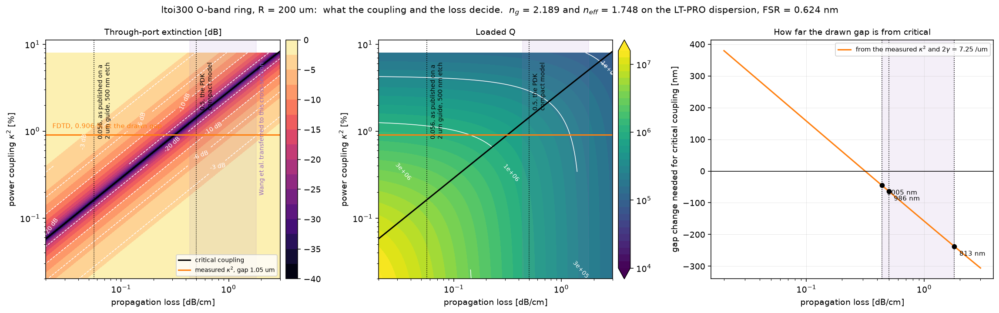
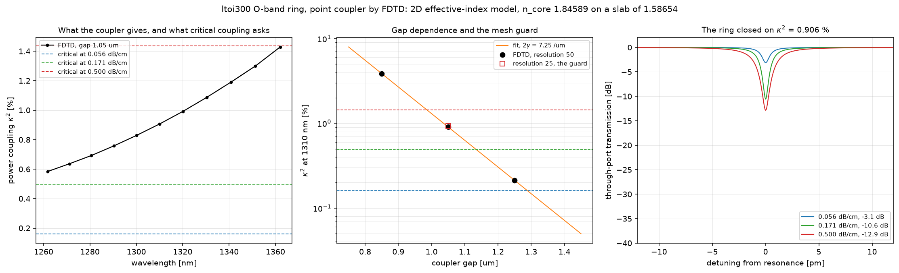
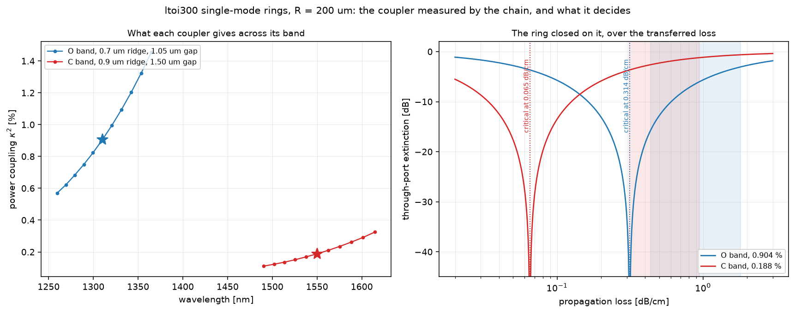
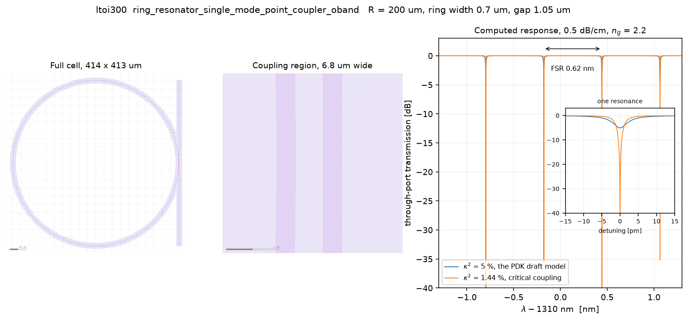

# The LTOI300 ring resonator, and what decides its extinction

A study of the single-mode ring resonator cells of the Luxtelligence LTOI300
process design kit, being
`ring_resonator_single_mode_point_coupler_oband` and its C-band counterpart in
[`design-chain/pdk/lxt_pdk_gf/ltoi300/cells.py`](../../design-chain/pdk/lxt_pdk_gf/ltoi300/cells.py).
The geometry is taken from the open PDK. The material dispersion is taken from
the LT-PRO design manual, which is held under the foundry's terms and is
described under "The foundry material model" below.

The study was conducted on 2026-09-03 against chain revision `87a4d23`.

## The question

The cell docstring states that the coupler gap is set for critical coupling,
and that the condition is loss-specific. Extinction and loaded Q therefore
follow from the power coupling of the point coupler measured against the
round-trip loss of the ring. Both terms carry an uncertainty of roughly a
factor of two, so the study maps the outcome over the range of both rather
than quoting one figure.

## The foundry material model

The generic library at
[`design-chain/pdk/materials.yaml`](../../design-chain/pdk/materials.yaml)
carries the bulk congruent Zelmon fit for lithium tantalate. The LT-PRO design
manual states a different fit for the thin film, of the single-resonance form

```
n^2 = eps_inf + A l^2 / (l^2 - B^2) - P l^2
```

The two differ materially:

| At 1.31 um | n_o | n_e |
| --- | --- | --- |
| Bulk congruent Zelmon, the generic library | 2.10231 | 2.10168 |
| Thin film, Wang et al., held as an override | 2.11900 | 2.12300 |
| LT-PRO design manual, Table 5 | 2.14976 | 2.15521 |

The manual's fit is about 0.048 above the bulk fit and 0.031 above the
published thin-film values. It also places `n_e` above `n_o`, which reverses
the ordering of congruent bulk material.

The coefficients are held in an untracked foundry file at
`design-chain/pdk/LXT_LT_PRO/materials_lt_pro.yaml`, on the same terms as the
rule decks beside it. The evaluation of that form is generic capability and is
implemented in [`materials.py`](../../design-chain/src/picchain/materials.py)
as `sellmeier_epsinf`. Capability is tracked and the foundry's numbers are not.

Two further figures from the manual are recorded in that file. The
radio-frequency permittivity is stated as 54 across the c axis and 43 along it,
where the generic library carries the bulk congruent values of 40.9 and 42.5.
That difference of a third does not affect this study and bears directly on any
electrode or travelling-wave design on this platform.

## What was run

Five design files pose the ring cross-section to the chain. Each runs in
under a minute and each verifies PASS on every target.

| File | Purpose |
| --- | --- |
| [`design_oband_ltpro.yaml`](design_oband_ltpro.yaml) | The 0.7 um ridge at 1310 nm on the foundry dispersion. This is the run of record |
| [`design_cband_ltpro.yaml`](design_cband_ltpro.yaml) | The 0.9 um ridge at 1550 nm on the foundry dispersion |
| [`design_oband.yaml`](design_oband.yaml) | The same O-band section on the generic bulk fit, retained as the comparison |
| [`design_cband.yaml`](design_cband.yaml) | The same C-band section on the generic bulk fit |
| [`design_oband_measured_index.yaml`](design_oband_measured_index.yaml) | The O-band section on the published thin-film indices, which brackets the material choice |

Execution:

```bash
picchain run examples/ltoi300_ring/design_oband_ltpro.yaml
```

The run tree is written to `runs/` beside the design file and is excluded from
version control.

## What the chain returned

On the foundry dispersion, which is the run of record:

| Quantity | O-band, 0.7 um at 1310 nm | C-band, 0.9 um at 1550 nm |
| --- | --- | --- |
| `n_eff` | 1.74826 | 1.70287 |
| `n_g` | 2.18939 | 2.13040 |
| Guided modes | 1 | 1 |
| Slab index floor | 1.5864 | 1.5509 |
| Free spectral range at R = 200 um | 0.6237 nm, 109.0 GHz | 0.8974 nm, 111.9 GHz |

The PDK compact model states `neff` 1.75 and `ng` 2.2 in the O band, and 1.7
and 2.1 in the C band. The solve reproduces those to 0.1 per cent in `n_eff`
and 0.5 per cent in `n_g`, so the compact model was evidently built on the same
thin-film dispersion the manual publishes. The TODO beside the group index
records that it had not been confirmed, and this run confirms it.

On the generic bulk fit the same geometry returns `n_eff` 1.70629 and `n_g`
2.12836 in the O band. The difference from the run of record is entirely the
material model, and it moves the free spectral range by 2.9 per cent. Any
earlier statement in this repository that the PDK group index is high by three
per cent arose from the bulk fit and is withdrawn.

The finite-element cross-check and the bend solve were run on the bulk fit and
were not repeated, the quantities they bound being insensitive to a uniform
shift of the film index. They returned an agreement of 6.5e-4 in `n_eff`
between the two solvers at a polarisation purity of 0.995, a bend index shift
of 4.2e-5 at 200 um radius, and a radiation caustic 17.2 um from the guide. The
bend is therefore a straight guide for every practical purpose at this radius,
and the same cross-section still guides at 60 um.

## The tolerance map



The map is drawn over propagation loss and power coupling, on the indices of
the run of record. It is produced by
[`scripts/tolerance_map.py`](scripts/tolerance_map.py):

```bash
python examples/ltoi300_ring/scripts/tolerance_map.py figures/tolerance_map.png
```

The coupling required for critical coupling is 0.162 per cent at 0.056 dB/cm
and 1.436 per cent at 0.5 dB/cm. That factor of nine corresponds to 240 nm of
gap, the coupling falling exponentially at 9.41 per micrometre for this
cross-section.

The gap drawn in the PDK is 1.05 um, and the coupling there has been measured
by the time-domain solve described in the next section. It is 0.906 per cent at
1310 nm. The three losses therefore place the drawn gap as follows.

| Assumed loss | Required coupling | Gap that would be critical | Regime as drawn |
| --- | --- | --- | --- |
| 0.5 dB/cm, the PDK compact model | 1.44 % | 986 nm | undercoupled, 12.9 dB |
| 0.315 dB/cm | 0.91 % | 1050 nm | critical |
| 0.171 dB/cm, a mass-manufactured LTOI substrate | 0.49 % | 1134 nm | overcoupled, 10.6 dB |
| 0.056 dB/cm, unreduced lithium tantalate | 0.16 % | 1288 nm | overcoupled, 3.1 dB |

The drawn gap is critically coupled at 0.315 dB/cm, and at no other loss. The
statement in the cell docstring is therefore conditional on a loss that the PDK
does not name, and the compact model beside it assumes 0.5 dB/cm, at which the
ring is undercoupled and reaches 12.9 dB rather than the complete extinction
critical coupling implies.

All three loss figures come from Wang et al., Nature 629, 784 (2024), held at
[`references/`](../../references/), except the first. That paper measures
5.6 dB/m on unreduced lithium tantalate, 7.3 dB/m on the wafer used for optical
applications, and 17.1 dB/m on a mass-manufactured LTOI substrate. The last is
the figure a volume process is most likely to present, and it sits between the
two the earlier revisions of this study carried. The film, the poling and the
etch of that work differ from the ltoi300 process, and the LT-PRO manual states
no propagation loss of its own. The loss is therefore an axis of the map and
not an input to an answer.

## The point coupler, by FDTD



The coupling is the one quantity that neither the mode solver nor the transfer
matrix can supply, and it was measured in the plane rather than in three
dimensions. The PDK cross-section draws the 120 nm slab 6.0 um either side of
every ridge, so ring and bus stand on one continuous slab and the lateral
problem separates cleanly. The two-dimensional effective-index reduction is
therefore the appropriate instrument, at a cost of two minutes against the
estimated 8.5 hours a three-dimensional window would have taken.

The model carries a core index of 1.84589, being the 300 nm column through the
ridge, on a background of 1.58654, being the 120 nm slab column, both solved
from the LT-PRO dispersion by the chain's own slab solver. The bus is straight
and the ring is the exact circle written as its lateral displacement, sampled at
201 stations over a window of 40 um. A normalisation run of the bus alone gives
the incident amplitude, and the run with the ring present gives what remains in
the bus and what has crossed. The runner is
[`scripts/meep_point_coupler.py`](scripts/meep_point_coupler.py) and it is
invoked as the chain invokes its own, through WSL:

```bash
wsl.exe -d Ubuntu-22.04 -- bash -lc "~/.local/bin/micromamba run -n mpp   mpirun -np 12 python <path>/scripts/meep_point_coupler.py job.json out.json"
```

| Job | Gap | Resolution | Power coupling at 1310 nm | Unitarity |
| --- | --- | --- | --- | --- |
| `g850_r50` | 0.85 um | 50 | 3.8505 % | 0.99843 |
| `g1050_r50` | 1.05 um | 50 | 0.9063 % | 0.99962 |
| `g1250_r50` | 1.25 um | 50 | 0.2118 % | 0.99991 |
| `g1050_r25` | 1.05 um | 25 | 0.9300 % | 0.99963 |

Four things are established by that table.

The coupling at the drawn gap is 0.906 per cent, and the two ports account for
all the power to within four parts in ten thousand. A point coupler at this
separation has no radiation channel, so the measurement rests on its own
internal check rather than on an assumption.

The mesh is converged. Doubling the resolution from 25 to 50 moves the coupling
by 2.6 per cent, against a question whose span is a factor of nine, so the
convergence guard required for a time-domain measurement is satisfied with
margin.

The gap dependence is exponential over the three gaps to within 0.2 per cent,
at 7.251 per micrometre in the logarithm. That is a field decay constant of
3.625 per micrometre, against 3.514 predicted from the ridge and slab indices,
which agrees to 3 per cent and confirms that the decay is set by the slab and
not by the oxide. Earlier revisions of this study used the oxide and were wrong
in the exponent for that reason.

The coupling rises by a factor of 2.4 across the O band, from 0.584 per cent at
1262 nm to 1.429 per cent at 1362 nm. Critical coupling is therefore a
condition at one wavelength. On a 0.5 dB/cm process the drawn cell would pass
through critical coupling near 1362 nm and be undercoupled everywhere below it.

Two limits of the model are to be stated. The effective-index reduction carries
no vertical radiation channel, so a three-dimensional run remains the check on
whether any power leaves the slab; the unitarity above bounds only what leaves
laterally. The reduction also assumes the two guides are identical, which they
are, and that the arc may be truncated at 20 um, beyond which the fitted decay
puts the omitted contribution at about 2 per cent.

## The propagation loss, transferred from the literature

The loss was the last unmeasured term, and the two papers in
[`references/`](../../references/) settle it only after a correction that is
larger than the figures themselves.

Only Wang et al. reports a propagation loss. The companion modulator paper
quotes a fibre-to-fibre coupling loss of 12 dB and a microwave loss of
4.6 dB/cm at 120 GHz, and no optical propagation loss at all. Wang et al.
reports four, all measured at 1550 nm on a guide 2.0 um wide etched 500 nm into
a 600 nm film, leaving a 100 nm slab: 5.6 dB/m on the best unreduced resonator,
7.3 dB/m typical of unreduced material, 8.8 dB/m on the best field of a reduced
LTOI substrate, and 17.1 dB/m as the wafer mean of that substrate. A spiral of
1.75 by 0.6 um returns about 9 dB/m.

Those numbers cannot be carried to the ring as they stand. The same paper
separates the loss by thermal response spectroscopy and finds an absorption
rate of 2.0 MHz against a total of 26.8 MHz, so 93 per cent of the loss is
scattering. Scattering at an etched wall is a property of the geometry as much
as of the process, and the ring is 0.7 um wide etched 180 nm into a 300 nm
film. Its mode meets the sidewall far more strongly than a 2 um guide does.

The transfer is made by the sidewall interaction, being the integral of the
field intensity along both etched walls over the integral across the section,
which is the quantity Payne and Lacey put the scattering loss in proportion to.
Both fields are solved by the chain on the same material file, so nothing but
the geometry differs. The script is
[`scripts/loss_transfer.py`](scripts/loss_transfer.py).

| Cross-section | Sidewall interaction |
| --- | --- |
| The ring, 0.7 um wide, 180 nm etch, at 1310 nm | 0.32388 /um |
| The reference, 2.0 um wide, 500 nm etch, at 1310 nm | 0.02870 /um |
| The reference, 2.0 um wide, 500 nm etch, at 1550 nm | 0.03889 /um |

The ring meets its walls 11.3 times as strongly as the reference guide at the
same wavelength, and 8.3 times as strongly as the reference at the wavelength
the loss was measured. Scaling the scattering part of each published figure by
that ratio, and carrying the absorption across unchanged, gives the following.

| Published, at 1550 nm on the reference guide | Transferred to the ring |
| --- | --- |
| 5.6 dB/m, best unreduced | 0.44 to 0.59 dB/cm |
| 7.3 dB/m, typical unreduced | 0.57 to 0.77 dB/cm |
| 8.8 dB/m, best reduced field | 0.69 to 0.93 dB/cm |
| 17.1 dB/m, reduced wafer mean | 1.33 to 1.80 dB/cm |

The range in each row is the two ratios above. The bracket that results,
roughly 0.44 to 1.80 dB/cm, is the purple band on the tolerance map.

Three consequences follow.

The 0.5 dB/cm the PDK compact model carries is not the pessimistic figure it
appeared to be. It sits at the optimistic edge of what the literature implies
for this geometry, and it is consistent with the best material in that paper.

The figure of 0.056 dB/cm has no bearing on this cell. It belongs to a guide
whose mode barely touches the wall, and transferring it without the correction
was the error in the earlier revisions of this study.

The ring as drawn is undercoupled across the whole transferred bracket. The gap
that would be critical is 1005 nm at 0.44 dB/cm and 813 nm at 1.80 dB/cm,
against the 1050 nm the PDK draws, and the extinction falls from 12.9 dB at
0.5 dB/cm to about 4 dB at 1.8 dB/cm.

The transfer assumes the two processes leave the same sidewall roughness. That
is the weakest step in the chain of reasoning here, the etch depth differing by
a factor of nearly three and the processes being those of different
laboratories. It is the reason the answer is a bracket, and it is the reason a
gap ladder still belongs on the mask.

## The C-band cell, completed



The C-band cell was carried as a cross-section until 2026-09-03 and is now
measured on the same footing as the O-band one, through the chain's own coupler
structure at `examples/ltoi300_ring/design_cband_coupler.yaml`.

| Quantity | Value |
| --- | --- |
| Power coupling at 1550 nm, gap 1.50 um | 0.188 % |
| Unitarity | 0.99991 |
| Mesh guard, resolution 25 against 50 | 1.8 %, resolved |
| Critical-coupling loss | 0.065 dB/cm |
| Loss transferred to this cross-section | 0.31 to 0.95 dB/cm |
| Through-port extinction across that bracket | 1.2 to 3.7 dB |

The gap sweep is exponential to within five parts in ten thousand.

| Gap | Power coupling | Unitarity |
| --- | ---: | ---: |
| 1.30 um | 0.6087 % | 0.99971 |
| 1.50 um | 0.1882 % | 0.99991 |
| 1.70 um | 0.0583 % | 0.99997 |

The fitted decay constant is 2.932 per micrometre against 2.850 predicted from
the ridge and slab indices, agreeing to 2.9 per cent. The O-band cell returned
3.625 against 3.514, agreeing to 3.2 per cent. The same physics governs both,
and the slab sets the decay in each.

The loss transfer is cleaner here than in the O band, both this cross-section
and the reference guide of Wang et al. being compared at 1550 nm. The sidewall
interaction is 0.22971 per micrometre against 0.03889, a ratio of 5.91 that is
geometry alone with no wavelength difference folded into it.

**The C-band cell is the weaker of the two by a wide margin.** Its 1.5 um gap
reaches critical coupling only at 0.065 dB/cm, which is below the best material
reported in the literature and far below what this geometry implies. Across the
transferred bracket it returns one to four decibels of extinction, where the
O-band cell returns three to sixteen. Critical coupling would require a gap of
1.235 um at 0.31 dB/cm and 1.046 um at 0.95 dB/cm, being 300 to 450 nm tighter
than drawn and still clear of the 300 nm minimum gap the process states.

Both cells are drawn together by
[`scripts/coupler_bands.py`](scripts/coupler_bands.py), which reads what the
stage published rather than solving again:

```bash
python examples/ltoi300_ring/scripts/coupler_bands.py     examples/ltoi300_ring/runs figures/coupler_bands.png
```

## The multimode cell, and the mode its coupler actually feeds

The kit ships a second pair of rings, `ring_resonator_multimode_point_coupler`
in each band, which widen the ring to 1.5 um and narrow the gap to 0.75 um in
the O band. A wider ring meets its etched walls less, so its loss is lower, and
that is the reason such a cell exists.

The cross-section carries three guided modes.

| Ring mode | Effective index | Mismatch against the 0.7 um bus at 1.74826 |
| --- | ---: | ---: |
| Fundamental | 1.81250 | 0.06424 |
| Second | 1.71618 | 0.03208 |
| Third | 1.59347 | 0.15479 |

**The bus is closer to phase-matching the second mode than the fundamental, by a
factor of two.** That is a property of the widths the kit chose and it is
visible before any solve.

The coupler was measured with the ring drawn at its own width, the crossed power
resolved onto the three ring modes.

| Quantity | Value |
| --- | ---: |
| Total power coupling at 1310 nm | 0.7457 % |
| Into the fundamental | 0.0297 % |
| Into the second mode | 0.6746 % |
| Into the third mode | 0.0414 % |
| Unitarity | 0.99981 |
| Mesh guard, resolution 25 against 50 | 3.04 %, resolved |

**Nine parts in ten of the coupled power land in the ring's second mode.** The
fundamental, which is the mode a wide low-loss ring exists to use, receives
0.0297 per cent, being one twenty-fifth of what the single-mode cell delivers to
its own fundamental at 0.906 per cent.

Three consequences follow for anyone placing this cell.

The resonance a measurement would see is built on the second-order mode. Its
free spectral range follows that mode's group index rather than the
fundamental's, and its loss is that of a mode which meets the sidewall more
strongly than the fundamental of the same guide, which removes the reason for
widening the ring.

Critical coupling for the fundamental would need a propagation loss near
0.010 dB/cm, that being the round-trip loss which 0.0297 per cent matches. No
lithium tantalate process reported anywhere approaches it, so the fundamental
resonance of this cell is deeply undercoupled on any real wafer.

The total coupling of 0.7457 per cent would be critical at 0.2587 dB/cm, which
sits inside the transferred loss bracket of 0.31 to 0.95 dB/cm. A device
measured at the through port would therefore show a reasonably deep resonance,
and it would be the second mode's.

The measurement is of the planar reduction and the caveat is the usual one: the
indices are those of the effective-index model, so the mismatches above are the
reduced ones. The ordering of the three modes and the position of the bus
between the first two are robust to that, being set by the widths.

### The same drawing at the other wavelength, and it behaves

The C-band cell is the same construction: a 1.5 um ring, a narrower bus, and a
gap the kit widens to 1.2 um. At 1550 nm the ring carries two guided modes
rather than three, the third having fallen below the slab floor of 1.55094, and
the ordering of the mismatches reverses.

| | O band | C band |
| --- | ---: | ---: |
| Bus width and index | 0.7 um, 1.74826 | 0.9 um, 1.70287 |
| Ring fundamental | 1.81250 | 1.74695 |
| Ring second mode | 1.71618 | 1.62728 |
| Mismatch to the fundamental | 0.06424 | **0.04408** |
| Mismatch to the second | **0.03208** | 0.07559 |

The measurement follows the mismatch in both bands.

| Where the coupled power lands | O band | C band |
| --- | ---: | ---: |
| Total coupling | 0.7457 % | 0.2032 % |
| Into the fundamental | 0.0297 %, being 4.0 % of it | **0.1892 %, being 93.1 %** |
| Into the second mode | 0.6746 %, being 90.5 % | 0.0098 %, being 4.8 % |
| Into the third mode | 0.0414 % | 0.0042 % |
| Unitarity | 0.99981 | 1.00002 |
| Mesh guard | 3.04 %, resolved | 0.49 %, resolved |

**The C-band cell feeds the mode it was widened for and the O-band cell does
not.** The two are the same drawing at two wavelengths, and the wavelength
decides which mode the coupler serves. The kit states no such distinction, and
the two cells carry the same docstring but for the band named in it.

The C-band cell is also coherent as a design. Its total coupling of 0.2032 per
cent is close to the 0.188 per cent of the single-mode cell beside it, so
widening the ring buys the lower sidewall interaction of a wider guide without
changing the coupling, which is what such a cell is for.

Its critical-coupling loss is 0.0655 dB/cm, below the transferred bracket of
0.31 to 0.95, so it is undercoupled on any realistic wafer and returns 1.2 to
3.7 dB of extinction. That is the same shortfall the single-mode C-band cell
carries, and it is a matter of the gap rather than of the mode.

### The four ring cells together

| Cell | Total coupling | Into the fundamental | Critical loss for the fundamental | Extinction over 0.31 to 0.95 dB/cm |
| --- | ---: | ---: | ---: | ---: |
| Single-mode, O band | 0.906 % | all of it | 0.3145 dB/cm | 3.1 to 15.8 dB |
| Multimode, O band | 0.746 % | 0.0297 % | 0.0103 dB/cm | negligible |
| Single-mode, C band | 0.188 % | all of it | 0.0651 dB/cm | 1.2 to 3.7 dB |
| Multimode, C band | 0.203 % | 0.1892 % | 0.0655 dB/cm | 1.2 to 3.7 dB |

Only the O-band single-mode cell is coupled near critically for the loss this
platform is likely to deliver. The other three are undercoupled, two of them by
about a factor of five in coupling, and the O-band multimode cell by a factor of
thirty in the mode that matters.

## The layout figure



The cell as drawn, the coupling region, and the through-port response computed
from the round-trip. It is produced by
[`scripts/ring_layout_figure.py`](scripts/ring_layout_figure.py), which must be
run from the PDK directory so that the vendored `ltoi300` package is imported
in preference to any copy installed in `site-packages`:

```bash
cd design-chain/pdk/lxt_pdk_gf
python ../../examples/ltoi300_ring/scripts/ring_layout_figure.py out.png
```

That figure was produced before the mode solve and uses the group index of the
PDK compact model, which the run of record has since confirmed to 0.5 per cent.
The free spectral range it states, 0.62 nm, therefore stands.

## What remains

The propagation loss of this geometry has been measured by nobody. What the
literature supports is the bracket of 0.44 to 1.80 dB/cm derived above, and the
gap ladder on the mask is what would replace it with a measurement.

A three-dimensional run of the same coupler would test the one channel the
planar reduction cannot carry, being power radiated vertically out of the slab.
It is worth an overnight job before a mask is committed and it is not required
to read the result above.

The propagation loss is not obtainable by simulation. A ladder of five rings at
50 nm steps over plus and minus 200 nm around the drawn gap, together with
rings of two radii, separates loss from coupling in one transmission
measurement. That span is read from the map, and the structures are a mask
decision to be taken before submission.

The finite-element cross-check and the bend solve are to be repeated on the
foundry dispersion when either is next relied upon.
